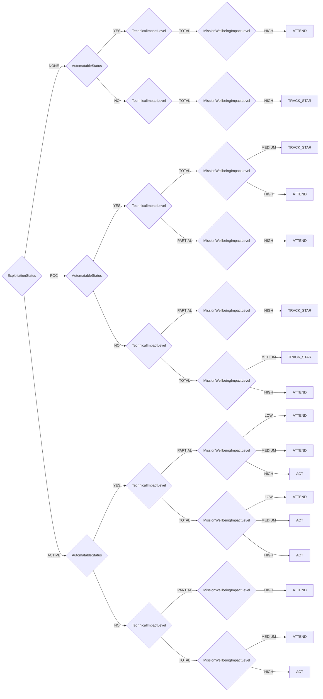

# Python implementation of SSVC (Stakeholder-Specific Vulnerability Categorization)

[](https://pypi.org/project/ssvc/) [](../../actions/workflows/action.yml)

## Installation

From pypi.org `pip install ssvc`

## Documentation

Complete documentation for each methodology is available in the `docs/` folder:

### Available Methodologies & Documentation

| Methodology | Description | Documentation |
|-------------|-------------|---------------|
| **CISA** | CISA Stakeholder-Specific Vulnerability Categorization methodology | [docs/cisa.md](docs/cisa.md) |
| **Coordinator Triage** | CERT/CC Coordinator Triage Decision Model for vulnerability coordination | [docs/coordinator_triage.md](docs/coordinator_triage.md) |
| **Coordinator Publication** | CERT/CC Coordinator Publication Decision Model for vulnerability disclosure | [docs/coordinator_publication.md](docs/coordinator_publication.md) |
| **Supplier** | CERT/CC Supplier Decision Model for prioritizing patch creation | [docs/supplier.md](docs/supplier.md) |
| **Deployer** | CERT/CC Deployer Decision Model for prioritizing patch deployment | [docs/deployer.md](docs/deployer.md) |

Each documentation file includes:
- Complete decision tree diagrams (Mermaid format)
- Decision point descriptions and valid values
- Usage examples and code samples
- References to official methodology sources

### Example Decision Tree: CISA Methodology

The following diagram shows how the CISA methodology's decision tree works, demonstrating the hierarchical decision-making process:



This decision tree shows how the CISA methodology evaluates vulnerabilities through four main decision points:
1. **Exploitation Status** (NONE, POC, ACTIVE) 
2. **Automatable Status** (YES, NO)
3. **Technical Impact Level** (PARTIAL, TOTAL)
4. **Mission & Wellbeing Impact Level** (LOW, MEDIUM, HIGH)

The tree navigates through these decision points to arrive at one of four possible actions: TRACK, TRACK*, ATTEND, or ACT.

## SSVC Usage

This library now supports multiple SSVC methodologies through a plugin-based architecture. You can use the built-in methodologies or create your own.

The SSVC framework was developed by the CERT/CC Software Engineering Institute at Carnegie Mellon University. More information can be found at https://certcc.github.io/SSVC/

For detailed documentation on each methodology, see the [Documentation](#documentation) section above.

### Quick Start

```python
import ssvc

# List available methodologies
print("Available methodologies:", ssvc.list_methodologies())

# Use CISA methodology (default)
decision = ssvc.Decision(
    methodology='cisa',  # or omit for default
    exploitation='active',
    automatable='no',
    technical_impact='total',
    mission_wellbeing_impact='high'
)
print(f"CISA Decision: {decision.outcome.action.value} (Priority: {decision.outcome.priority.value})")

# Use Coordinator Triage methodology
decision = ssvc.Decision(
    methodology='coordinator_triage',
    report_public='no',
    supplier_contacted='yes', 
    report_credibility='credible',
    supplier_cardinality='multiple',
    supplier_engagement='active',
    utility='super_effective',
    public_safety_impact='significant'
)
print(f"Coordinator Triage Decision: {decision.outcome.action.value} (Priority: {decision.outcome.priority.value})")

# Use Supplier Decision Model
decision = ssvc.Decision(
    methodology='supplier',
    exploitation='active',
    utility='super_effective',
    technical_impact='total',
    public_safety_impact='significant'
)
print(f"Supplier Decision: {decision.outcome.action.value} (Priority: {decision.outcome.priority.value})")

# Use Deployer Decision Model
decision = ssvc.Decision(
    methodology='deployer',
    exploitation='active',
    system_exposure='open',
    utility='super_effective',
    human_impact='very_high'
)
print(f"Deployer Decision: {decision.outcome.action.value} (Priority: {decision.outcome.priority.value})")

# Use Coordinator Publication Decision Model
decision = ssvc.Decision(
    methodology='coordinator_publication',
    supplier_involvement='uncooperative_unresponsive',
    exploitation='active',
    public_value_added='precedence'
)
print(f"Coordinator Publication Decision: {decision.outcome.action.value} (Priority: {decision.outcome.priority.value})")
```

### CISA Methodology Examples

The CISA methodology follows these steps:
1. Determine the exploitation status of the vulnerability
2. Assess the technical impact, considering the automatability, mission prevalence, and public well-being impact  
3. Navigate through the decision tree to arrive at a decision point: Track, Track*, Attend, or Act

```python
import ssvc

# Using enum-style values
decision = ssvc.Decision(
    methodology='cisa',
    exploitation='poc',
    automatable='yes', 
    technical_impact='partial',
    mission_wellbeing_impact='medium'
)
assert decision.outcome.action.value == 'track'
assert decision.outcome.priority.value == 'low'

# Incremental input 
decision = ssvc.Decision(methodology='cisa')
decision.exploitation = 'active'
decision.automatable = 'yes'
decision.technical_impact = 'total' 
decision.mission_wellbeing_impact = 'high'

outcome = decision.evaluate()
assert outcome.action.value == 'act'
assert outcome.priority.value == 'immediate'
```

### Coordinator Triage Methodology Examples

The Coordinator Triage methodology evaluates whether a vulnerability coordination center should coordinate disclosure:

```python
import ssvc

# High-priority coordination case
decision = ssvc.Decision(
    methodology='coordinator_triage',
    report_public='no',
    supplier_contacted='yes',
    report_credibility='credible', 
    supplier_cardinality='multiple',
    supplier_engagement='active',
    utility='super_effective',
    public_safety_impact='significant'
)
assert decision.outcome.action.value == 'coordinate'
assert decision.outcome.priority.value == 'high'

# Low-priority decline case
decision = ssvc.Decision(
    methodology='coordinator_triage', 
    report_public='yes',
    supplier_contacted='no',
    report_credibility='not_credible',
    supplier_cardinality='one',
    utility='laborious',
    public_safety_impact='minimal'
)
assert decision.outcome.action.value == 'decline'
assert decision.outcome.priority.value == 'low'
```

### Decision Points and Value Types

When designing decision methodologies, it's important to understand how decision points should be structured. Decision points in SSVC decision trees should use qualitative categorical values rather than quantitative ranges.

#### Why Qualitative Values?

SSVC decision trees are designed to be practical and usable tools for decision-making. Using qualitative categorical values (e.g., Low/Medium/High/Critical) rather than quantitative ranges (e.g., numeric scores from 0-10) has several important advantages:

1. **Manageable Complexity**: Quantitative ranges can exponentially increase the complexity of decision trees. For example, if you used a 0-10 scale for a decision point, that would create 11 possible branches at that node. With multiple such nodes, the tree quickly becomes unwieldy. In contrast, a qualitative scale with 5 values (Info/Low/Med/High/Critical) keeps the decision tree manageable.

2. **Practical Decision-Making**: Qualitative categories align better with how humans actually make decisions. Rather than trying to precisely score something as a "7.3", decision-makers can more reliably assess whether something is "High" or "Critical".

3. **Clear Boundaries**: Qualitative categories provide clearer boundaries for decision-making. When using numeric scores, adjacent values (e.g., 6.9 vs 7.0) can be arbitrarily close while still falling on different sides of a decision boundary.

4. **Reduced Overconfidence**: Numeric scoring systems can create a false sense of precision. Qualitative categories better reflect the inherent uncertainty in vulnerability assessments.

#### Common Misconceptions

Some users may be tempted to integrate scoring systems like CVSS directly into decision trees. However, this approach is problematic:

- A CVSS score has 100 possible values (0.0-10.0 in 0.1 increments), which would create 100 branches at a single node
- This would make the tree exponentially more complex and difficult to maintain
- It would also make the decision process less transparent and harder to explain

Instead, it's better to use qualitative mappings of quantitative scores. For example, you might map CVSS scores to qualitative severity ratings:
- 0.0-3.9 → Low
- 4.0-6.9 → Medium
- 7.0-8.9 → High
- 9.0-10.0 → Critical

This preserves the benefits of quantitative analysis while maintaining the usability of the decision tree.

### Backward Compatibility

The library maintains backward compatibility with the original API:

```python
# Legacy API (deprecated but still works)
from ssvc import ExploitationLevel, Automatable, TechnicalImpact, MissionWellbeingImpact

# This will show a deprecation warning
from ssvc import LegacyDecision
decision = LegacyDecision(
    ExploitationLevel.ACTIVE,
    Automatable.NO, 
    TechnicalImpact.TOTAL,
    MissionWellbeingImpact.HIGH
)
```

## Creating New Methodologies

This library supports extensible methodologies through a YAML-based plugin system. You can create your own decision methodologies by defining them in YAML format and generating Python plugins.

### YAML Methodology Structure

Each methodology is defined in a YAML file with the following structure:

```yaml
name: "Your Methodology Name"
description: "Description of your methodology"
version: "1.0"
url: "https://example.com/methodology-docs"

enums:
  DecisionPointName:
    - VALUE_ONE
    - VALUE_TWO
    - VALUE_THREE
  AnotherDecisionPoint:
    - OPTION_A
    - OPTION_B
  ActionType:
    - ACTION_ONE
    - ACTION_TWO
    - ACTION_THREE
  DecisionPriorityLevel:
    - LOW
    - MEDIUM
    - HIGH

priorityMap:
  ACTION_ONE: LOW
  ACTION_TWO: MEDIUM
  ACTION_THREE: HIGH

decisionTree:
  type: DecisionPointName
  children:
    VALUE_ONE:
      type: AnotherDecisionPoint
      children:
        OPTION_A: ACTION_ONE
        OPTION_B: ACTION_TWO
    VALUE_TWO: ACTION_THREE
    VALUE_THREE:
      type: AnotherDecisionPoint
      children:
        OPTION_A: ACTION_TWO
        OPTION_B: ACTION_THREE

defaultAction: ACTION_ONE
```

### Required YAML Elements

1. **Metadata Fields**:
   - `name`: Human-readable name for the methodology
   - `description`: Brief description of the methodology's purpose  
   - `version`: Version string (e.g., "1.0")
   - `url`: Reference URL for methodology documentation

2. **enums Section**:
   - Define all decision points as enum classes
   - Must include `ActionType` enum for possible actions
   - Must include a priority enum (ending with "PriorityLevel")
   - Use UPPERCASE values for enum entries
   - Quote boolean-like values: `"YES"` and `"NO"` instead of `YES` and `NO`

3. **priorityMap Section**:
   - Maps each action to a priority level
   - Keys must match `ActionType` enum values
   - Values must match the priority enum values

4. **decisionTree Section**:
   - Defines the decision tree structure
   - Each node has a `type` (enum name) and `children` (possible values)
   - Leaf nodes contain action names directly
   - Non-leaf nodes contain nested decision structures

5. **defaultAction**:
   - Fallback action for unmapped decision paths
   - Must match an `ActionType` enum value

### Example: Custom Risk Assessment Methodology

```yaml
name: "Custom Risk Assessment"
description: "A simplified risk-based vulnerability assessment methodology"
version: "1.0"
url: "https://example.com/custom-risk-methodology"

enums:
  SeverityLevel:
    - LOW
    - MEDIUM
    - HIGH
    - CRITICAL
  ExposureLevel:
    - INTERNAL
    - EXTERNAL
  BusinessImpactLevel:
    - MINIMAL
    - MODERATE
    - SIGNIFICANT
  ActionType:
    - MONITOR
    - SCHEDULE
    - EXPEDITE
    - EMERGENCY
  DecisionPriorityLevel:
    - LOW
    - MEDIUM
    - HIGH
    - CRITICAL

priorityMap:
  MONITOR: LOW
  SCHEDULE: MEDIUM
  EXPEDITE: HIGH
  EMERGENCY: CRITICAL

decisionTree:
  type: SeverityLevel
  children:
    CRITICAL:
      type: ExposureLevel
      children:
        EXTERNAL: EMERGENCY
        INTERNAL:
          type: BusinessImpactLevel
          children:
            SIGNIFICANT: EMERGENCY
            MODERATE: EXPEDITE
            MINIMAL: SCHEDULE
    HIGH:
      type: ExposureLevel
      children:
        EXTERNAL:
          type: BusinessImpactLevel
          children:
            SIGNIFICANT: EXPEDITE
            MODERATE: SCHEDULE
            MINIMAL: SCHEDULE
        INTERNAL: SCHEDULE
    MEDIUM: SCHEDULE
    LOW: MONITOR

defaultAction: MONITOR
```

### Generating Plugins from YAML

1. **Place YAML files** in `src/ssvc/methodologies/`
2. **Run the generator**:
   ```bash
   python scripts/generate_plugins.py
   ```
3. **Generated files**:
   - Python plugin: `src/ssvc/plugins/{methodology_name}.py`
   - Documentation: `docs/{methodology_name}.md`

The generator creates:
- Enum classes for all decision points
- Priority mapping dictionary
- Outcome class with priority/action mapping
- Decision class with parameter validation
- Decision tree traversal logic
- Markdown documentation with mermaid diagrams

### Plugin Registration

Plugins are automatically discovered and registered when the library loads. The plugin system:

1. **Auto-discovery**: Scans the `src/ssvc/plugins/` directory
2. **Registration**: Registers Decision classes found in plugin modules
3. **Usage**: Access via `ssvc.Decision(methodology='plugin_name')`

### Testing New Methodologies

When creating a new methodology, ensure you:

1. **Test all decision paths** with comprehensive test cases
2. **Validate edge cases** and default action fallbacks  
3. **Verify enum value handling** for both programmatic and string inputs
4. **Check priority mappings** are correct for all actions
5. **Document expected behavior** with examples

### Contributing Methodologies to the Library

To contribute a new methodology to the official library:

1. **Create a YAML definition** following the structure above
2. **Generate and test the plugin** thoroughly
3. **Add comprehensive test coverage** (aim for 100%)
4. **Document the methodology** with usage examples
5. **Submit a Pull Request** with:
   - YAML methodology definition
   - Generated plugin code (via the generator)
   - Test suite covering all decision paths
   - Documentation updates
   - Reference to official methodology sources

#### Pull Request Requirements

- **YAML file**: Well-structured with proper metadata
- **Tests**: 100% code coverage for the new methodology
- **Documentation**: Clear examples and methodology overview
- **References**: Links to authoritative methodology sources
- **Validation**: All existing tests must still pass

#### Review Process

Contributed methodologies will be reviewed for:
- **Accuracy**: Correct implementation of the official methodology
- **Completeness**: Full decision tree coverage
- **Quality**: Clean, well-documented code
- **Testing**: Comprehensive test coverage
- **Compatibility**: No conflicts with existing methodologies

Approved methodologies become part of the official library and are available to all users via `pip install ssvc`.

