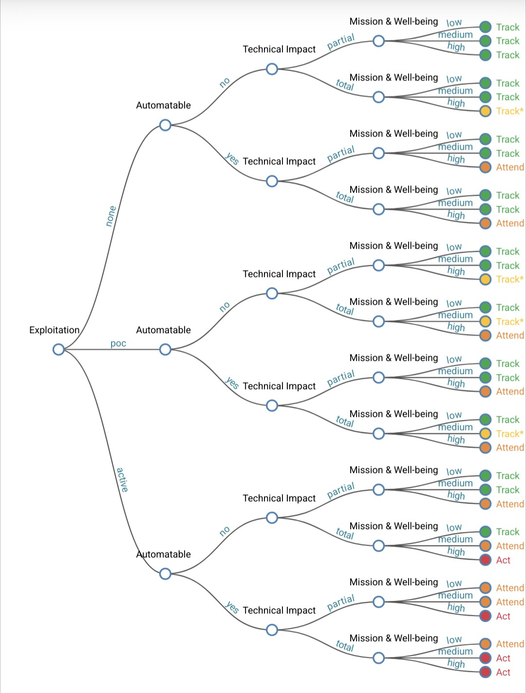

# Python implementation of SSVC (Stakeholder-Specific Vulnerability Categorization)

[](https://pypi.org/project/ssvc/) [](../../actions/workflows/action.yml)

## Installation

From pypi.org `pip install ssvc`

## SSVC Usage

To use SSVC, follow these steps:
1. Determine the exploitation status of the vulnerability.
2. Assess the technical impact, considering the automatability, mission prevalence, and public well-being impact.
3. Navigate through the decision tree to arrive at a decision point: Track, Track*, Attend, or Act.

Or write some simple python:

### Example

```python
from ssvc import Decision, ExploitationLevel, Automatable, TechnicalImpact, MissionWellbeingImpact, ActionCISA, DecisionPriority
decision = Decision(
    ExploitationLevel.POC,
    Automatable.YES,
    TechnicalImpact.PARTIAL,
    MissionWellbeingImpact.MEDIUM,
)
assert decision.outcome.priority == DecisionPriority.LOW, "SSVC priority should be LOW"
assert decision.outcome.action == ActionCISA.TRACK, "SSVC decision should be TRACK"
```

Using strings also works

```python
import ssvc

decision = ssvc.Decision(
    exploitation='active',
    automatable='no',
    technical_impact='total',
    mission_wellbeing='high',
)
assert decision.outcome.priority == ssvc.DecisionPriority.HIGH, "SSVC priority should be HIGH"
assert decision.outcome.action == ssvc.ActionCISA.ACT, "SSVC decision should be ACT"
```

Input incrementally and control how to handle decisions

```python
from ssvc import Decision, ExploitationLevel, Automatable, TechnicalImpact, MissionWellbeingImpact, ActionCISA, DecisionPriority
decision = Decision()
# what is the ExploitationLevel?
decision.exploitation = ExploitationLevel.POC
# is it Automatable?
decision.automatable = Automatable.YES
# figure out the technical impact
decision.technical_impact = TechnicalImpact.PARTIAL
# Wha't our impact?
decision.mission_wellbeing = MissionWellbeingImpact.MEDIUM

# Get a decision outcome
outcome = decision.evaluate()

# decisions are return and available as a new variable
assert outcome.priority == DecisionPriority.LOW, "SSVC priority should be LOW"
# or use the `decision.outcome` like before
assert decision.outcome.action == ActionCISA.TRACK, "SSVC decision should be TRACK"
```

## SSVC Overview

The Stakeholder-Specific Vulnerability Categorization (SSVC) is a decision-making framework developed to prioritize vulnerabilities based on a stakeholder's context. This approach allows for a more nuanced response to vulnerabilities, tailored to the specific needs and impact on an organization's mission and well-being.

The Stakeholder-Specific Vulnerability Categorization (SSVC) was created by Carnegie Mellon University's Software Engineering Institute (SEI) in collaboration with the Cybersecurity and Infrastructure Security Agency (CISA) in 2019. It is a methodology designed to provide a systematic approach to vulnerability analysis, taking into account factors like a vulnerability's exploitation status, impacts to safety, and the prevalence of the affected product. CISA further developed its customized SSVC decision tree in 2020 to better assess vulnerabilities relevant to the United States government, as well as state, local, tribal, and territorial governments, and critical infrastructure entities.

SSVC is utilized to improve decision-making processes in vulnerability management by employing decision trees. The framework is modular, aiming to provide tools that are adaptable to the context of different vulnerability managers. This system helps organizations prioritize their vulnerability response and public messaging regarding cybersecurity threats.

The CISA SSVC decision tree leads to four possible decisions—Track, Track*, Attend, and Act—based on five values: exploitation status, technical impact, automatability, mission prevalence, and public well-being impact. The idea is to prioritize actions during vulnerability management and to avoid a one-size-fits-all approach by considering the specific circumstances and requirements of the stakeholders involved.



The decision tree used for SSVC (Stakeholder-Specific Vulnerability Categorization) is a flowchart-like structure that helps in decision-making by considering multiple criteria specific to stakeholders' concerns. Unlike traditional binary trees that have a yes/no (or true/false) structure, the SSVC decision tree allows for multiple branches at each decision node, representing a range of choices or conditions rather than a simple binary choice.

For more detailed information about SSVC, you can consult the CISA SSVC Guide and the resources provided on GitHub by the CERT Coordination Center (CERT/CC) where tools such as an SSVC calculator and documentation [can be found](https://www.cisa.gov/stakeholder-specific-vulnerability-categorization-ssvc).

In the SSVC:

- **Each node represents a decision point** with several branches corresponding to the possible values or outcomes of that decision (e.g., "none," "proof of concept," "active" for exploitation).
- **Each path from root to leaf represents a sequence of decisions** that leads to a specific outcome or action recommendation (e.g., "Track," "Track*," "Attend," "Act").
- **The tree is customized for stakeholders**, which means that it can have different branches and outcomes depending on the roles and priorities of different groups or individuals involved in vulnerability management.

This kind of decision tree is particularly suitable for complex scenarios where decisions depend on various factors and the impact of those factors may differ among stakeholders. The SSVC provides a structured and systematic approach to evaluate vulnerabilities based on the specific context and criteria relevant to the stakeholders.
