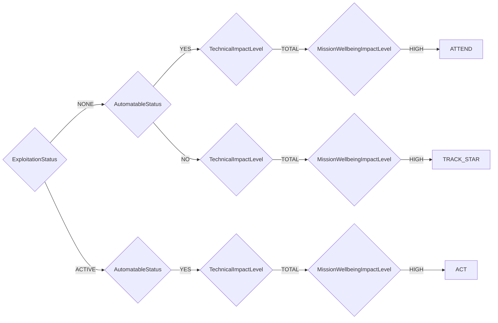

# Python implementation of SSVC (Stakeholder-Specific Vulnerability Categorization)

[](https://pypi.org/project/ssvc/) [](../../actions/workflows/action.yml) [](https://pypi.org/project/ssvc/) [](https://github.com/Vulnetix/python-ssvc/blob/main/LICENSE)

A comprehensive Python implementation of the Stakeholder-Specific Vulnerability Categorization (SSVC) framework with a plugin-based architecture supporting multiple decision methodologies, vector string representation, and JSON schema validation.

## Language Implementations

SSVC is available in multiple programming languages:

- **Python**: This library - [python-ssvc](https://github.com/Vulnetix/python-ssvc) [](https://pypi.org/project/ssvc/)
- **TypeScript**: [typescript-ssvc](https://github.com/Vulnetix/typescript-ssvc) [](https://www.npmjs.com/package/ssvc)
- **Go**: 🚧 In Development

## Installation

### Via Package Managers

```bash
# Using pip
pip install ssvc

# Using uv (recommended for development)
uv add ssvc

# Using Poetry
poetry add ssvc

# Using Pipenv
pipenv install ssvc

# Using Conda
conda install -c conda-forge ssvc
```

### From Source

```bash
# Clone and install from GitHub source
git clone https://github.com/Vulnetix/python-ssvc.git
cd python-ssvc
uv sync
uv run python -m pip install -e .

# For development with all tools
just dev-install
```

## Background and Rationale

### What is SSVC?

The Stakeholder-Specific Vulnerability Categorization (SSVC) framework was developed by the CERT Coordination Center (CERT/CC) at Carnegie Mellon University's Software Engineering Institute to address the limitations of traditional vulnerability scoring systems like CVSS.

**Key Problems SSVC Solves:**

1. **Context-Specific Decisions**: Unlike CVSS which provides universal scores, SSVC recognizes that vulnerability prioritization depends heavily on the stakeholder's role and context
2. **Decision-Oriented**: Focuses on actionable outcomes rather than abstract numeric scores
3. **Qualitative Assessment**: Uses meaningful categories instead of potentially misleading precision of numeric scales
4. **Multiple Perspectives**: Provides different decision models for different stakeholder roles (CISA, Coordinators, Suppliers, Deployers)

### Why Use SSVC?

- **Practical Decision Making**: Provides clear, actionable guidance rather than numeric scores that require interpretation
- **Stakeholder-Specific**: Different methodologies for different organizational roles and responsibilities
- **Evidence-Based**: Built on research into how vulnerability management decisions are actually made
- **Transparent Logic**: Decision trees make the reasoning process explicit and auditable
- **Community Endorsed**: Adopted by CISA and other major cybersecurity organizations

## Available Methodologies & Documentation

This library supports multiple SSVC methodologies through a plugin-based architecture:

| Methodology | Description | Documentation | Official Source |
|-------------|-------------|---------------|-----------------|
| **CISA** | CISA Stakeholder-Specific Vulnerability Categorization | [docs/cisa.md](docs/cisa.md) | [CISA SSVC Guide](https://www.cisa.gov/stakeholder-specific-vulnerability-categorization-ssvc) |
| **Coordinator Triage** | CERT/CC Coordinator Triage Decision Model | [docs/coordinator_triage.md](docs/coordinator_triage.md) | [CERT/CC Coordinator Triage](https://certcc.github.io/SSVC/howto/coordination_triage_decision/) |
| **Coordinator Publication** | CERT/CC Coordinator Publication Decision Model | [docs/coordinator_publication.md](docs/coordinator_publication.md) | [CERT/CC Publication Decision](https://certcc.github.io/SSVC/howto/publication_decision/) |
| **Supplier** | CERT/CC Supplier Decision Model for patch prioritization | [docs/supplier.md](docs/supplier.md) | [CERT/CC Supplier Tree](https://certcc.github.io/SSVC/howto/supplier_tree/) |
| **Deployer** | CERT/CC Deployer Decision Model for patch deployment | [docs/deployer.md](docs/deployer.md) | [CERT/CC Deployer Tree](https://certcc.github.io/SSVC/howto/deployer_tree/) |

### Documentation Structure

Each methodology documentation includes:

- **Complete Decision Tree Diagrams** (Mermaid format for GitHub rendering)
- **Decision Point Descriptions** and valid values with examples
- **Priority Mappings** showing how actions map to priority levels
- **Usage Examples** with comprehensive code samples
- **Vector String Support** with parameter abbreviations and format
- **File Integrity Verification** with SHA1 checksums
- **References** to official methodology sources and specifications

## SSVC Usage

### Quick Start Examples

```python
import ssvc

# List all available methodologies
methodologies = ssvc.list_methodologies()
print("Available methodologies:", methodologies)
# Output: ['cisa', 'coordinator_triage', 'coordinator_publication', 'supplier', 'deployer']

# CISA Methodology - Government/Enterprise vulnerability prioritization
decision = ssvc.Decision(
    methodology='cisa',  # Can be omitted (CISA is default)
    exploitation='active',
    automatable='no',
    technical_impact='total',
    mission_wellbeing_impact='high'
)
print(f"CISA Decision: {decision.outcome.action.value} (Priority: {decision.outcome.priority.value})")
# Output: CISA Decision: act (Priority: immediate)

# Coordinator Triage - Vulnerability coordination center decisions
decision = ssvc.Decision(
    methodology='coordinator_triage',
    report_public='no',
    supplier_contacted='yes', 
    report_credibility='credible',
    supplier_cardinality='multiple',
    utility='super_effective',
    public_safety_impact='significant'
)
print(f"Coordinator Triage: {decision.outcome.action.value} (Priority: {decision.outcome.priority.value})")
# Output: Coordinator Triage: coordinate (Priority: high)

# Supplier Decision - Software vendor patch development prioritization
decision = ssvc.Decision(
    methodology='supplier',
    exploitation='active',
    utility='super_effective',
    technical_impact='total',
    public_safety_impact='significant'
)
print(f"Supplier Decision: {decision.outcome.action.value} (Priority: {decision.outcome.priority.value})")
# Output: Supplier Decision: immediate (Priority: immediate)

# Deployer Decision - IT organization patch deployment prioritization
decision = ssvc.Decision(
    methodology='deployer',
    exploitation='active',
    system_exposure='open',
    utility='super_effective',
    human_impact='very_high'
)
print(f"Deployer Decision: {decision.outcome.action.value} (Priority: {decision.outcome.priority.value})")
# Output: Deployer Decision: immediate (Priority: immediate)

# Coordinator Publication - Coordinated disclosure timing decisions
decision = ssvc.Decision(
    methodology='coordinator_publication',
    supplier_involvement='uncooperative_unresponsive',
    exploitation='active',
    public_value_added='precedence'
)
print(f"Publication Decision: {decision.outcome.action.value} (Priority: {decision.outcome.priority.value})")
# Output: Publication Decision: publish (Priority: high)
```

### Advanced Usage Patterns

#### Incremental Decision Building

```python
import ssvc

# Start with methodology, add parameters incrementally
decision = ssvc.Decision(methodology='cisa')

# Set parameters step by step (useful for interactive tools)
decision.exploitation = 'poc'
decision.automatable = 'yes'
decision.technical_impact = 'partial'
decision.mission_wellbeing_impact = 'medium'

# Evaluate when ready
outcome = decision.evaluate()
print(f"Result: {outcome.action.value} (Priority: {outcome.priority.value})")
# Output: Result: track (Priority: low)
```

#### Case-Insensitive Input Handling

```python
import ssvc

# All of these work (case-insensitive)
decision1 = ssvc.Decision('cisa', exploitation='ACTIVE', automatable='NO')
decision2 = ssvc.Decision('cisa', exploitation='active', automatable='no')
decision3 = ssvc.Decision('cisa', exploitation='Active', automatable='No')

# All produce the same result
print(decision1.exploitation == decision2.exploitation == decision3.exploitation)
# Output: True
```

#### Error Handling and Validation

```python
import ssvc

try:
    # Invalid methodology
    decision = ssvc.Decision(methodology='invalid_method')
except ValueError as e:
    print(f"Error: {e}")
    # Output: Error: Unknown methodology: invalid_method

try:
    # Invalid parameter value
    decision = ssvc.Decision(methodology='cisa', exploitation='invalid_value')
except ValueError as e:
    print(f"Error: {e}")
    # Output: Error: 'INVALID_VALUE' is not a valid ExploitationStatus
```

## Vector String Support

All methodologies support SSVC vector strings for compact representation and data exchange:

### Basic Vector String Operations

```python
import ssvc

# Create decision and generate vector string
decision = ssvc.Decision('cisa',
    exploitation='active',
    automatable='yes',
    technical_impact='total',
    mission_wellbeing_impact='high'
)

# Generate compact vector representation
vector = decision.to_vector()
print(vector)
# Output: CISAv1/E:A/A:Y/T:T/M:H/2025-08-29T17:53:26.057876/

# Parse vector string back to decision
parsed_decision = ssvc.Decision.from_vector(vector)
outcome = parsed_decision.evaluate()
print(f"Parsed result: {outcome.action.value} (Priority: {outcome.priority.value})")
# Output: Parsed result: act (Priority: immediate)
```

### Vector String Format

Vector strings follow this format:
```
{methodology_prefix}v{version}/{parameter_abbreviations}/{timestamp}/
```

**Examples by methodology:**
- CISA: `CISAv1/E:A/A:Y/T:T/M:H/2025-08-29T17:53:26.057876/`
- Coordinator Triage: `COORD_TRIAGEv1/RP:N/SC:Y/RC:C/CA:M/U:S/PS:S/2025-08-29T17:53:26.079151/`
- Supplier: `SUPPLIERv1/E:A/U:S/T:T/PS:S/2025-08-29T17:53:26.082345/`

### Vector String Use Cases

1. **Data Storage**: Compact database storage of SSVC decisions
2. **API Integration**: RESTful API request/response payloads
3. **Logging**: Structured logging of vulnerability decisions
4. **Reporting**: CSV exports and data interchange
5. **Caching**: Cache keys for decision results

## Schema Validation

All methodology definitions are validated against a comprehensive JSON schema:

### Schema Structure

```python
# Schema location: src/ssvc/methodologies/schema.json
# Validates:
# - Methodology metadata (name, description, version, url)
# - Enum definitions and value consistency
# - Decision tree structure and completeness
# - Priority mappings and action definitions
# - Vector string metadata and parameter mappings

# Validation is automatic during plugin generation
```

### Custom Schema Validation

```bash
# Validate all YAML files against schema
uv run python scripts/validate_methodologies.py

# Or use the justfile
just validate-methodologies
```

### Schema Compliance Benefits

1. **Consistency**: Ensures all methodologies follow the same structure
2. **Completeness**: Validates that decision trees cover all possible paths
3. **Correctness**: Catches errors in methodology definitions early
4. **Interoperability**: Guarantees compatibility across different implementations

## Decision Tree Visualization

### Example: CISA Methodology Decision Tree

The CISA methodology uses a hierarchical decision tree to evaluate vulnerabilities:



### Decision Point Explanations

**CISA Methodology Decision Points:**

1. **Exploitation Status** (NONE, POC, ACTIVE)
   - Current state of exploit availability and usage
2. **Automatable Status** (YES, NO)
   - Whether the vulnerability can be exploited automatically
3. **Technical Impact Level** (PARTIAL, TOTAL)
   - Scope of system compromise possible
4. **Mission & Wellbeing Impact Level** (LOW, MEDIUM, HIGH)
   - Impact on organizational mission and public wellbeing

**Resulting Actions:**
- **TRACK**: Monitor vulnerability, no immediate action required (Priority: LOW)
- **TRACK*** Monitor with enhanced attention (Priority: MEDIUM)
- **ATTEND**: Schedule remediation in current cycle (Priority: MEDIUM)
- **ACT**: Immediate action required (Priority: IMMEDIATE)

### Decision Points and Value Design

When designing decision methodologies, SSVC uses qualitative categorical values rather than quantitative ranges for several important reasons:

#### Why Qualitative Values?

1. **Manageable Complexity**: Quantitative ranges exponentially increase decision tree complexity. A 0-10 scale creates 11 branches per node, making trees unwieldy quickly.

2. **Practical Decision-Making**: Qualitative categories align with human decision-making. Rather than scoring something as "7.3", decision-makers can reliably assess "High" vs "Critical".

3. **Clear Boundaries**: Qualitative categories provide clearer decision boundaries. Numeric scores can have arbitrarily close values (6.9 vs 7.0) falling on different sides of decision points.

4. **Reduced Overconfidence**: Numeric scoring can create false precision. Qualitative categories better reflect inherent uncertainty in vulnerability assessment.

#### Common Misconceptions

Some users may want to integrate CVSS scores directly into decision trees, but this is problematic:

- CVSS has 100 possible values (0.0-10.0), creating 100 branches per node
- This makes trees exponentially complex and harder to maintain
- Decision processes become less transparent and harder to explain

**Better approach:** Use qualitative mappings of quantitative scores:
```python
# Example: CVSS to qualitative severity mapping
cvss_to_severity = {
    (0.0, 3.9): 'low',
    (4.0, 6.9): 'medium',
    (7.0, 8.9): 'high',
    (9.0, 10.0): 'critical'
}
```

This preserves quantitative analysis benefits while maintaining decision tree usability.

## Backward Compatibility

The library maintains backward compatibility with the original API while encouraging migration to the new plugin-based system:

### Legacy API (Deprecated)

```python
# Legacy API - shows deprecation warnings but still works
from ssvc import ExploitationLevel, Automatable, TechnicalImpact, MissionWellbeingImpact

from ssvc import LegacyDecision  # Shows deprecation warning
decision = LegacyDecision(
    ExploitationLevel.ACTIVE,
    Automatable.NO, 
    TechnicalImpact.TOTAL,
    MissionWellbeingImpact.HIGH
)
```

### Migration Guide

**Old approach:**
```python
from ssvc import LegacyDecision, ExploitationLevel, Automatable
decision = LegacyDecision(ExploitationLevel.ACTIVE, Automatable.NO, ...)
```

**New approach:**
```python
import ssvc
decision = ssvc.Decision('cisa', exploitation='active', automatable='no', ...)
```

## Creating Custom Methodologies

The library supports extensible methodologies through a YAML-based plugin system:

### YAML Methodology Structure

```yaml
name: "Your Methodology Name"
description: "Brief description of methodology purpose"
version: "1.0"
url: "https://example.com/methodology-docs"

enums:
  DecisionPointName:
    - VALUE_ONE
    - VALUE_TWO
    - VALUE_THREE
  ActionType:
    - ACTION_ONE
    - ACTION_TWO
    - ACTION_THREE
  DecisionPriorityLevel:
    - LOW
    - MEDIUM
    - HIGH

priorityMap:
  ACTION_ONE: LOW
  ACTION_TWO: MEDIUM
  ACTION_THREE: HIGH

decisionTree:
  type: DecisionPointName
  children:
    VALUE_ONE: ACTION_ONE
    VALUE_TWO:
      type: AnotherDecisionPoint
      children:
        OPTION_A: ACTION_TWO
        OPTION_B: ACTION_THREE
    VALUE_THREE: ACTION_THREE

defaultAction: ACTION_ONE

# Vector string support (optional)
vectorMetadata:
  prefix: CUSTOM
  version: v1
  parameterMappings:
    decision_point_name:
      abbrev: D
      enumType: DecisionPointName
      valueMappings:
        VALUE_ONE: V1
        VALUE_TWO: V2
        VALUE_THREE: V3
```

### Required YAML Elements

1. **Metadata Fields**:
   - `name`: Human-readable methodology name
   - `description`: Brief purpose description
   - `version`: Version string (e.g., "1.0")
   - `url`: Reference URL for methodology documentation

2. **Enums Section**:
   - Define all decision points as enum classes
   - Must include `ActionType` enum for possible actions
   - Must include priority enum ending with "PriorityLevel"
   - Use UPPERCASE values, quote boolean-like values (`"YES"`, `"NO"`)

3. **Priority Map Section**:
   - Maps each action to priority level
   - Keys must match `ActionType` enum values
   - Values must match priority enum values

4. **Decision Tree Section**:
   - Hierarchical tree structure
   - Each node has `type` (enum name) and `children` (value mappings)
   - Leaf nodes contain action names directly
   - Non-leaf nodes contain nested decision structures

5. **Default Action**:
   - Fallback action for unmapped decision paths
   - Must match an `ActionType` enum value

6. **Vector Metadata** (Optional):
   - Enables vector string support
   - Defines parameter abbreviations and value mappings
   - Required for `to_vector()` and `from_vector()` methods

### Plugin Generation Workflow

```bash
# 1. Create YAML file in methodologies directory
# src/ssvc/methodologies/my_methodology.yaml

# 2. Validate against schema
just validate-methodologies

# 3. Generate Python plugin
just generate-plugins

# 4. Generated files:
# - src/ssvc/plugins/my_methodology.py (Python code)
# - docs/my_methodology.md (Documentation)

# 5. Test your methodology
python -c "
import ssvc
decision = ssvc.Decision('my_methodology', param1='value1', param2='value2')
print(decision.outcome.action.value)
"
```

### Generated Plugin Components

The generator creates:
- **Enum classes** for all decision points
- **Priority mapping** dictionary
- **Outcome class** with priority/action mapping
- **Decision class** with parameter validation and case-insensitive input
- **Decision tree traversal** logic with complete path coverage
- **Vector string methods** (if metadata provided)
- **Comprehensive documentation** with Mermaid diagrams and usage examples

### Plugin Auto-Discovery

Plugins are automatically discovered and registered:

1. **Auto-discovery**: Library scans `src/ssvc/plugins/` directory at import
2. **Registration**: Registers Decision classes found in plugin modules
3. **Usage**: Access via `ssvc.Decision(methodology='plugin_name')`
4. **Listing**: View all available via `ssvc.list_methodologies()`

### Testing New Methodologies

Ensure comprehensive testing for new methodologies:

```python
import pytest
import ssvc

def test_custom_methodology_complete_coverage():
    """Test all decision paths in custom methodology."""
    # Test each possible combination of inputs
    test_cases = [
        {'param1': 'value1', 'param2': 'option_a', 'expected': 'action_one'},
        {'param1': 'value2', 'param2': 'option_b', 'expected': 'action_two'},
        # ... cover all decision tree paths
    ]

    for case in test_cases:
        decision = ssvc.Decision('custom', **{k: v for k, v in case.items() if k != 'expected'})
        assert decision.outcome.action.value == case['expected']

def test_custom_methodology_vector_strings():
    """Test vector string generation and parsing."""
    decision = ssvc.Decision('custom', param1='value1', param2='option_a')
    vector = decision.to_vector()

    # Parse back and verify equivalence
    parsed = ssvc.Decision.from_vector(vector)
    assert parsed.outcome.action.value == decision.outcome.action.value

def test_custom_methodology_edge_cases():
    """Test error handling and validation."""
    with pytest.raises(ValueError):
        ssvc.Decision('custom', param1='invalid_value')
```

### Contributing Methodologies

To contribute a methodology to the official library:

#### Requirements

1. **YAML Definition**: Well-structured methodology following schema
2. **Official Source**: Link to authoritative methodology documentation
3. **Complete Testing**: 100% code coverage for all decision paths
4. **Clear Documentation**: Usage examples and methodology overview
5. **Validation**: All existing tests must continue passing

#### Submission Process

1. **Fork Repository**: [github.com/Vulnetix/python-ssvc](https://github.com/Vulnetix/python-ssvc)
2. **Create YAML**: Define methodology in `src/ssvc/methodologies/`
3. **Generate Plugin**: Run generator to create Python code
4. **Add Tests**: Comprehensive test coverage in `tests/`
5. **Update Documentation**: Add methodology to README and docs
6. **Submit Pull Request**: Include all generated files and tests

#### Review Criteria

- **Accuracy**: Correct implementation of official methodology
- **Completeness**: Full decision tree coverage with no gaps
- **Quality**: Clean, well-documented, maintainable code
- **Testing**: Comprehensive test suite with edge cases
- **Compatibility**: No conflicts with existing methodologies

Approved methodologies become part of the official library distribution.

## Development Setup

### Prerequisites

- Python 3.11+
- [uv](https://github.com/astral-sh/uv) (recommended) or pip
- [just](https://github.com/casey/just) command runner

### Development Environment

```bash
# Clone repository
git clone https://github.com/Vulnetix/python-ssvc.git
cd python-ssvc

# Setup development environment
uv sync
uv run python -c "import ssvc; print('SSVC ready for development!')"

# Install development tools
just dev-install

# Verify setup
just qa  # Runs linting, type checking, and tests
```

### Available Development Commands

```bash
# Testing
just test          # Run tests with coverage (requires 100%)
just check         # Quick test run without coverage
just qa            # Run all quality checks

# Plugin Development
just validate-methodologies  # Validate YAML against schema
just generate-plugins       # Generate plugins from YAML
just dev                   # Full development cycle

# Code Quality
just lint          # Lint with ruff
just format        # Format code with ruff
just typecheck     # Type check with mypy

# Container Development
just container-build    # Build dev container
just container-dev     # Start container development session
just container-test    # Run tests in container

# Security & Compliance
just sarif         # Generate SARIF security reports
just sbom          # Generate CycloneDX software bill of materials

# Build & Publish
just build         # Build distribution packages
just publish       # Complete publish workflow
just version       # Show current version
```

### Project Structure

```
python-ssvc/
├── src/ssvc/                    # Main library code
│   ├── __init__.py             # Public API exports
│   ├── core.py                 # Plugin registry and Decision class
│   ├── legacy.py               # Backward compatibility (deprecated)
│   ├── methodologies/          # YAML methodology definitions
│   │   ├── schema.json         # JSON schema for validation
│   │   ├── cisa.yaml          # CISA methodology
│   │   ├── coordinator_triage.yaml
│   │   ├── supplier.yaml
│   │   └── ...
│   └── plugins/               # Generated Python plugins
│       ├── __init__.py
│       ├── cisa.py           # Generated from cisa.yaml
│       └── ...
├── tests/                     # Test suite (100% coverage)
│   ├── test_ssvc.py          # Core API tests
│   ├── test_ssvc_new.py      # Plugin system tests
│   └── test_ssvc_legacy.py   # Backward compatibility tests
├── docs/                      # Generated documentation
│   ├── cisa.md               # Generated from cisa.yaml
│   └── ...
├── scripts/                   # Development utilities
│   ├── generate_plugins.py   # YAML to Python generator
│   └── validate_methodologies.py  # Schema validator
├── justfile                   # Task runner commands
├── pyproject.toml            # Project configuration
├── PYPI.md                   # PyPI package description
└── README.md                 # This file
```

### Testing Strategy

The test suite ensures reliability across three areas:

- **`tests/test_ssvc.py`**: Core functionality using new API
- **`tests/test_ssvc_new.py`**: Comprehensive plugin system tests
- **`tests/test_ssvc_legacy.py`**: Backward compatibility tests

**Test Coverage Areas:**
- Plugin discovery and auto-registration
- Decision matrix tests for all methodology combinations
- Input validation and error handling
- Vector string generation and parsing
- Schema validation and YAML processing
- Cross-methodology compatibility

**Coverage Requirement:** 100% code coverage is enforced for all contributions.

## References and Resources

### Official SSVC Resources

- **Main SSVC Site**: [certcc.github.io/SSVC](https://certcc.github.io/SSVC/)
- **CISA SSVC Guide**: [cisa.gov/stakeholder-specific-vulnerability-categorization-ssvc](https://www.cisa.gov/stakeholder-specific-vulnerability-categorization-ssvc)
- **CERT/CC Documentation**: [certcc.github.io/SSVC/howto](https://certcc.github.io/SSVC/howto/)
- **Original Paper**: [Design decisions for building a vulnerability management decision pipeline](https://doi.org/10.1007/s00267-021-01483-z)

### Project Resources

- **GitHub Repository**: [github.com/Vulnetix/python-ssvc](https://github.com/Vulnetix/python-ssvc)
- **PyPI Package**: [pypi.org/project/ssvc](https://pypi.org/project/ssvc/)
- **Issue Tracker**: [github.com/Vulnetix/python-ssvc/issues](https://github.com/Vulnetix/python-ssvc/issues)
- **Discussions**: [github.com/Vulnetix/python-ssvc/discussions](https://github.com/Vulnetix/python-ssvc/discussions)

### Related Projects

- **TypeScript Implementation**: [typescript-ssvc](https://github.com/Vulnetix/typescript-ssvc)
- **Official SSVC Tools**: [github.com/CERTCC/SSVC](https://github.com/CERTCC/SSVC)

## License

Licensed under the Apache License 2.0. See [LICENSE](LICENSE) for the full license text.

## Contributing

We welcome contributions! Please see our [Contributing Guidelines](https://github.com/Vulnetix/python-ssvc/blob/main/CONTRIBUTING.md) and [Code of Conduct](https://github.com/Vulnetix/python-ssvc/blob/main/CODE_OF_CONDUCT.md).

### Ways to Contribute

1. **Report Bugs**: Use the [issue tracker](https://github.com/Vulnetix/python-ssvc/issues)
2. **Feature Requests**: Discuss new features in [discussions](https://github.com/Vulnetix/python-ssvc/discussions)
3. **Add Methodologies**: Contribute new SSVC methodologies via pull request
4. **Improve Documentation**: Help improve examples and explanations
5. **Code Quality**: Help with testing, performance, or code organization

For major changes, please open an issue first to discuss the proposed changes.