# AI/LLM Triage Decision Model

AI and LLM Vulnerability Triage for stakeholder-specific decision making

> **⚠️ DO NOT EDIT THIS FILE DIRECTLY**  
> This file is auto-generated. To make changes:
> 1. Edit the source YAML file: `methodologies/ai_llm_triage.yaml`
> 2. Run: `uv run python scripts/generate_plugins.py`

**Version:** 1.0  


## Decision Tree

```mermaid
flowchart LR
    ExploitationStatus_1{ExploitationStatus}
    StakeholderRole_2{StakeholderRole}
    ExploitationStatus_1 -->|NONE| StakeholderRole_2
    DeployerAttackVector_3{DeployerAttackVector}
    StakeholderRole_2 -->|DEPLOYER| DeployerAttackVector_3
    Action_ASSESS_RISK_4[ASSESS_RISK]
    DeployerAttackVector_3 -->|SUPPLY_CHAIN| Action_ASSESS_RISK_4
    Action_ASSESS_RISK_5[ASSESS_RISK]
    DeployerAttackVector_3 -->|MODEL_POISONING| Action_ASSESS_RISK_5
    Action_MONITOR_6[MONITOR]
    DeployerAttackVector_3 -->|INFRASTRUCTURE_COMPROMISE| Action_MONITOR_6
    ApplicationAttackVector_7{ApplicationAttackVector}
    StakeholderRole_2 -->|APPLICATION| ApplicationAttackVector_7
    Action_MONITOR_8[MONITOR]
    ApplicationAttackVector_7 -->|PROMPT_INJECTION| Action_MONITOR_8
    Action_PROMPT_SANITIZATION_9[PROMPT_SANITIZATION]
    ApplicationAttackVector_7 -->|TOOL_MISUSE| Action_PROMPT_SANITIZATION_9
    Action_FINETUNE_GUARDRAILS_10[FINETUNE_GUARDRAILS]
    ApplicationAttackVector_7 -->|PRIVILEGE_ESCALATION| Action_FINETUNE_GUARDRAILS_10
    Action_MONITOR_11[MONITOR]
    ApplicationAttackVector_7 -->|MEMORY_MANIPULATION| Action_MONITOR_11
    Action_MONITOR_12[MONITOR]
    ApplicationAttackVector_7 -->|ALIGNMENT_BYPASS| Action_MONITOR_12
    UserAttackVector_13{UserAttackVector}
    StakeholderRole_2 -->|USER| UserAttackVector_13
    Action_ASSESS_RISK_14[ASSESS_RISK]
    UserAttackVector_13 -->|DATA_EXTRACTION| Action_ASSESS_RISK_14
    Action_LOW_TRUST_15[LOW_TRUST]
    UserAttackVector_13 -->|PROMPT_MANIPULATION| Action_LOW_TRUST_15
    Action_LOW_TRUST_16[LOW_TRUST]
    UserAttackVector_13 -->|OUTPUT_MANIPULATION| Action_LOW_TRUST_16
    StakeholderRole_17{StakeholderRole}
    ExploitationStatus_1 -->|POC| StakeholderRole_17
    DeployerAttackVector_18{DeployerAttackVector}
    StakeholderRole_17 -->|DEPLOYER| DeployerAttackVector_18
    Action_FINETUNE_GUARDRAILS_19[FINETUNE_GUARDRAILS]
    DeployerAttackVector_18 -->|SUPPLY_CHAIN| Action_FINETUNE_GUARDRAILS_19
    Action_RETRAIN_MODEL_20[RETRAIN_MODEL]
    DeployerAttackVector_18 -->|MODEL_POISONING| Action_RETRAIN_MODEL_20
    Action_ASSESS_RISK_21[ASSESS_RISK]
    DeployerAttackVector_18 -->|INFRASTRUCTURE_COMPROMISE| Action_ASSESS_RISK_21
    ApplicationAttackVector_22{ApplicationAttackVector}
    StakeholderRole_17 -->|APPLICATION| ApplicationAttackVector_22
    Action_PROMPT_SANITIZATION_23[PROMPT_SANITIZATION]
    ApplicationAttackVector_22 -->|PROMPT_INJECTION| Action_PROMPT_SANITIZATION_23
    Action_FINETUNE_GUARDRAILS_24[FINETUNE_GUARDRAILS]
    ApplicationAttackVector_22 -->|TOOL_MISUSE| Action_FINETUNE_GUARDRAILS_24
    Action_RETRAIN_MODEL_25[RETRAIN_MODEL]
    ApplicationAttackVector_22 -->|PRIVILEGE_ESCALATION| Action_RETRAIN_MODEL_25
    Action_FINETUNE_GUARDRAILS_26[FINETUNE_GUARDRAILS]
    ApplicationAttackVector_22 -->|MEMORY_MANIPULATION| Action_FINETUNE_GUARDRAILS_26
    Action_PROMPT_SANITIZATION_27[PROMPT_SANITIZATION]
    ApplicationAttackVector_22 -->|ALIGNMENT_BYPASS| Action_PROMPT_SANITIZATION_27
    UserAttackVector_28{UserAttackVector}
    StakeholderRole_17 -->|USER| UserAttackVector_28
    Action_FINETUNE_GUARDRAILS_29[FINETUNE_GUARDRAILS]
    UserAttackVector_28 -->|DATA_EXTRACTION| Action_FINETUNE_GUARDRAILS_29
    Action_HIGH_RISK_30[HIGH_RISK]
    UserAttackVector_28 -->|PROMPT_MANIPULATION| Action_HIGH_RISK_30
    Action_HIGH_RISK_31[HIGH_RISK]
    UserAttackVector_28 -->|OUTPUT_MANIPULATION| Action_HIGH_RISK_31
    StakeholderRole_32{StakeholderRole}
    ExploitationStatus_1 -->|ACTIVE| StakeholderRole_32
    DeployerAttackVector_33{DeployerAttackVector}
    StakeholderRole_32 -->|DEPLOYER| DeployerAttackVector_33
    Action_IMMEDIATE_ACTION_34[IMMEDIATE_ACTION]
    DeployerAttackVector_33 -->|SUPPLY_CHAIN| Action_IMMEDIATE_ACTION_34
    Action_IMMEDIATE_ACTION_35[IMMEDIATE_ACTION]
    DeployerAttackVector_33 -->|MODEL_POISONING| Action_IMMEDIATE_ACTION_35
    Action_RETRAIN_MODEL_36[RETRAIN_MODEL]
    DeployerAttackVector_33 -->|INFRASTRUCTURE_COMPROMISE| Action_RETRAIN_MODEL_36
    ApplicationAttackVector_37{ApplicationAttackVector}
    StakeholderRole_32 -->|APPLICATION| ApplicationAttackVector_37
    Action_FINETUNE_GUARDRAILS_38[FINETUNE_GUARDRAILS]
    ApplicationAttackVector_37 -->|PROMPT_INJECTION| Action_FINETUNE_GUARDRAILS_38
    Action_RETRAIN_MODEL_39[RETRAIN_MODEL]
    ApplicationAttackVector_37 -->|TOOL_MISUSE| Action_RETRAIN_MODEL_39
    Action_IMMEDIATE_ACTION_40[IMMEDIATE_ACTION]
    ApplicationAttackVector_37 -->|PRIVILEGE_ESCALATION| Action_IMMEDIATE_ACTION_40
    Action_RETRAIN_MODEL_41[RETRAIN_MODEL]
    ApplicationAttackVector_37 -->|MEMORY_MANIPULATION| Action_RETRAIN_MODEL_41
    Action_FINETUNE_GUARDRAILS_42[FINETUNE_GUARDRAILS]
    ApplicationAttackVector_37 -->|ALIGNMENT_BYPASS| Action_FINETUNE_GUARDRAILS_42
    UserAttackVector_43{UserAttackVector}
    StakeholderRole_32 -->|USER| UserAttackVector_43
    Action_IMMEDIATE_ACTION_44[IMMEDIATE_ACTION]
    UserAttackVector_43 -->|DATA_EXTRACTION| Action_IMMEDIATE_ACTION_44
    Action_IMMEDIATE_ACTION_45[IMMEDIATE_ACTION]
    UserAttackVector_43 -->|PROMPT_MANIPULATION| Action_IMMEDIATE_ACTION_45
    Action_IMMEDIATE_ACTION_46[IMMEDIATE_ACTION]
    UserAttackVector_43 -->|OUTPUT_MANIPULATION| Action_IMMEDIATE_ACTION_46
```



## Decision Points

- **ExploitationStatus**: `NONE`, `POC`, `ACTIVE`
- **StakeholderRole**: `DEPLOYER`, `APPLICATION`, `USER`
- **DeployerAttackVector**: `SUPPLY_CHAIN`, `MODEL_POISONING`, `INFRASTRUCTURE_COMPROMISE`
- **ApplicationAttackVector**: `PROMPT_INJECTION`, `TOOL_MISUSE`, `PRIVILEGE_ESCALATION`, `MEMORY_MANIPULATION`, `ALIGNMENT_BYPASS`
- **UserAttackVector**: `DATA_EXTRACTION`, `PROMPT_MANIPULATION`, `OUTPUT_MANIPULATION`

## Usage

```python
from ssvc.plugins.ai_llm_triage import DecisionAiLlmTriage

decision = DecisionAiLlmTriage(
    # Set decision point values here
)

outcome = decision.evaluate()
print(f"Action: {outcome.action}")
print(f"Priority: {outcome.priority}")
```


## Vector String Support

This methodology supports SSVC vector strings for compact representation and interchange.

### Parameter Abbreviations

| Parameter | Abbreviation | Value Mappings |
|-----------|--------------|----------------|
| exploitation | E | NONE→N, POC→P, ACTIVE→A |
| stakeholder_role | SR | DEPLOYER→D, APPLICATION→A, USER→U |
| deployer_attack_vector | DAV | SUPPLY_CHAIN→SC, MODEL_POISONING→MP, INFRASTRUCTURE_COMPROMISE→IC |
| application_attack_vector | AAV | PROMPT_INJECTION→PI, TOOL_MISUSE→TM, PRIVILEGE_ESCALATION→PE, MEMORY_MANIPULATION→MM, ALIGNMENT_BYPASS→AB |
| user_attack_vector | UAV | DATA_EXTRACTION→DE, PROMPT_MANIPULATION→PM, OUTPUT_MANIPULATION→OM |

### Vector String Format

```
AI_LLMv2/[parameters]/[timestamp]/
```

### Example Usage

```python
# Generate vector string from decision
decision = DecisionAiLlmTriage(
    exploitation='NONE',
    stakeholder_role='DEPLOYER',
    deployer_attack_vector='SUPPLY_CHAIN',
    application_attack_vector='PROMPT_INJECTION',
    user_attack_vector='DATA_EXTRACTION',
)

vector_string = decision.to_vector()
print(vector_string)
# Output: AI_LLMv2/E:N/SR:D/DAV:SC/AAV:PI/UAV:DE/2024-07-23T20:34:21.000000/

# Parse vector string to create decision
parsed_decision = DecisionAiLlmTriage.from_vector("AI_LLMv2/E:N/SR:D/DAV:SC/AAV:PI/UAV:DE/2024-07-23T20:34:21.000000/")
outcome = parsed_decision.evaluate()
```

## File Integrity Verification

The generated files in this methodology have SHA1 checksums for verification:

### Checksum Verification Commands

Verify the integrity of generated files using these commands:

```bash
# Verify Python plugin file
echo "3c899800e2d4a59b8fc99f4755ce006f9cb69a4b  src/ssvc/plugins/ai_llm_triage.py" | sha1sum -c

# Verify all generated files using the justfile task
just verify-checksums

# Verify using actual file checksum  
sha1sum src/ssvc/plugins/ai_llm_triage.py
```

### Batch Verification

To verify all generated files at once:

```bash
# Verify all checksums from documentation metadata
just verify-checksums

# Alternative: Manual verification of all files
for doc in docs/*.md; do
    if [[ -f "$doc" ]]; then
        py_path=$(rg -N "path: src/ssvc/plugins/.*\.py" --only-matching "$doc" 2>/dev/null | head -1 | sed 's/path: //' || true)
        py_checksum=$(rg -N "checksum: [a-f0-9]+" --only-matching "$doc" 2>/dev/null | head -1 | sed 's/checksum: //' || true)
        if [[ -n "$py_path" ]] && [[ -n "$py_checksum" ]] && [[ -f "$py_path" ]]; then
            echo "$py_checksum  $py_path" | sha1sum -c
        fi
    fi
done
```

**Why This Matters**: Checksum verification ensures that generated files haven't been tampered with or corrupted. This is important for:
- **Security**: Detecting unauthorized modifications to generated code
- **Integrity**: Ensuring files match their expected content exactly  
- **Trust**: Providing cryptographic proof that files are authentic
- **Debugging**: Confirming file corruption isn't causing unexpected behavior
- **Compliance**: Meeting security requirements for code integrity verification

Always verify checksums before deploying or using generated files in production environments.
