# CISA Decision Model

CISA Stakeholder-Specific Vulnerability Categorization

> **⚠️ DO NOT EDIT THIS FILE DIRECTLY**  
> This file is auto-generated. To make changes:
> 1. Edit the source YAML file: `methodologies/cisa.yaml`
> 2. Run: `uv run python scripts/generate_plugins.py`

**Version:** 1.0  
**Reference:** [https://www.cisa.gov/stakeholder-specific-vulnerability-categorization-ssvc](https://www.cisa.gov/stakeholder-specific-vulnerability-categorization-ssvc)

## Decision Tree

```mermaid
flowchart LR
    ExploitationStatus_1{ExploitationStatus}
    AutomatableStatus_2{AutomatableStatus}
    ExploitationStatus_1 -->|NONE| AutomatableStatus_2
    TechnicalImpactLevel_3{TechnicalImpactLevel}
    AutomatableStatus_2 -->|YES| TechnicalImpactLevel_3
    MissionWellbeingImpactLevel_4{MissionWellbeingImpactLevel}
    TechnicalImpactLevel_3 -->|PARTIAL| MissionWellbeingImpactLevel_4
    Action_ATTEND_5[ATTEND]
    MissionWellbeingImpactLevel_4 -->|HIGH| Action_ATTEND_5
    MissionWellbeingImpactLevel_6{MissionWellbeingImpactLevel}
    TechnicalImpactLevel_3 -->|TOTAL| MissionWellbeingImpactLevel_6
    Action_ATTEND_7[ATTEND]
    MissionWellbeingImpactLevel_6 -->|HIGH| Action_ATTEND_7
    TechnicalImpactLevel_8{TechnicalImpactLevel}
    AutomatableStatus_2 -->|NO| TechnicalImpactLevel_8
    MissionWellbeingImpactLevel_9{MissionWellbeingImpactLevel}
    TechnicalImpactLevel_8 -->|PARTIAL| MissionWellbeingImpactLevel_9
    Action_TRACK_STAR_10[TRACK_STAR]
    MissionWellbeingImpactLevel_9 -->|HIGH| Action_TRACK_STAR_10
    MissionWellbeingImpactLevel_11{MissionWellbeingImpactLevel}
    TechnicalImpactLevel_8 -->|TOTAL| MissionWellbeingImpactLevel_11
    Action_TRACK_STAR_12[TRACK_STAR]
    MissionWellbeingImpactLevel_11 -->|HIGH| Action_TRACK_STAR_12
    AutomatableStatus_13{AutomatableStatus}
    ExploitationStatus_1 -->|POC| AutomatableStatus_13
    TechnicalImpactLevel_14{TechnicalImpactLevel}
    AutomatableStatus_13 -->|YES| TechnicalImpactLevel_14
    MissionWellbeingImpactLevel_15{MissionWellbeingImpactLevel}
    TechnicalImpactLevel_14 -->|TOTAL| MissionWellbeingImpactLevel_15
    Action_TRACK_STAR_16[TRACK_STAR]
    MissionWellbeingImpactLevel_15 -->|MEDIUM| Action_TRACK_STAR_16
    Action_ATTEND_17[ATTEND]
    MissionWellbeingImpactLevel_15 -->|HIGH| Action_ATTEND_17
    MissionWellbeingImpactLevel_18{MissionWellbeingImpactLevel}
    TechnicalImpactLevel_14 -->|PARTIAL| MissionWellbeingImpactLevel_18
    Action_ATTEND_19[ATTEND]
    MissionWellbeingImpactLevel_18 -->|HIGH| Action_ATTEND_19
    TechnicalImpactLevel_20{TechnicalImpactLevel}
    AutomatableStatus_13 -->|NO| TechnicalImpactLevel_20
    MissionWellbeingImpactLevel_21{MissionWellbeingImpactLevel}
    TechnicalImpactLevel_20 -->|PARTIAL| MissionWellbeingImpactLevel_21
    Action_TRACK_STAR_22[TRACK_STAR]
    MissionWellbeingImpactLevel_21 -->|HIGH| Action_TRACK_STAR_22
    MissionWellbeingImpactLevel_23{MissionWellbeingImpactLevel}
    TechnicalImpactLevel_20 -->|TOTAL| MissionWellbeingImpactLevel_23
    Action_TRACK_STAR_24[TRACK_STAR]
    MissionWellbeingImpactLevel_23 -->|MEDIUM| Action_TRACK_STAR_24
    Action_ATTEND_25[ATTEND]
    MissionWellbeingImpactLevel_23 -->|HIGH| Action_ATTEND_25
    AutomatableStatus_26{AutomatableStatus}
    ExploitationStatus_1 -->|ACTIVE| AutomatableStatus_26
    TechnicalImpactLevel_27{TechnicalImpactLevel}
    AutomatableStatus_26 -->|YES| TechnicalImpactLevel_27
    MissionWellbeingImpactLevel_28{MissionWellbeingImpactLevel}
    TechnicalImpactLevel_27 -->|PARTIAL| MissionWellbeingImpactLevel_28
    Action_ATTEND_29[ATTEND]
    MissionWellbeingImpactLevel_28 -->|LOW| Action_ATTEND_29
    Action_ATTEND_30[ATTEND]
    MissionWellbeingImpactLevel_28 -->|MEDIUM| Action_ATTEND_30
    Action_ACT_31[ACT]
    MissionWellbeingImpactLevel_28 -->|HIGH| Action_ACT_31
    MissionWellbeingImpactLevel_32{MissionWellbeingImpactLevel}
    TechnicalImpactLevel_27 -->|TOTAL| MissionWellbeingImpactLevel_32
    Action_ATTEND_33[ATTEND]
    MissionWellbeingImpactLevel_32 -->|LOW| Action_ATTEND_33
    Action_ACT_34[ACT]
    MissionWellbeingImpactLevel_32 -->|MEDIUM| Action_ACT_34
    Action_ACT_35[ACT]
    MissionWellbeingImpactLevel_32 -->|HIGH| Action_ACT_35
    TechnicalImpactLevel_36{TechnicalImpactLevel}
    AutomatableStatus_26 -->|NO| TechnicalImpactLevel_36
    MissionWellbeingImpactLevel_37{MissionWellbeingImpactLevel}
    TechnicalImpactLevel_36 -->|PARTIAL| MissionWellbeingImpactLevel_37
    Action_ATTEND_38[ATTEND]
    MissionWellbeingImpactLevel_37 -->|HIGH| Action_ATTEND_38
    MissionWellbeingImpactLevel_39{MissionWellbeingImpactLevel}
    TechnicalImpactLevel_36 -->|TOTAL| MissionWellbeingImpactLevel_39
    Action_ATTEND_40[ATTEND]
    MissionWellbeingImpactLevel_39 -->|MEDIUM| Action_ATTEND_40
    Action_ACT_41[ACT]
    MissionWellbeingImpactLevel_39 -->|HIGH| Action_ACT_41
```



## Decision Points

- **ExploitationStatus**: `NONE`, `POC`, `ACTIVE`
- **AutomatableStatus**: `YES`, `NO`
- **TechnicalImpactLevel**: `PARTIAL`, `TOTAL`
- **MissionWellbeingImpactLevel**: `LOW`, `MEDIUM`, `HIGH`

## Usage

```python
from ssvc.plugins.cisa import DecisionCisa

decision = DecisionCisa(
    # Set decision point values here
)

outcome = decision.evaluate()
print(f"Action: {outcome.action}")
print(f"Priority: {outcome.priority}")
```


## Vector String Support

This methodology supports SSVC vector strings for compact representation and interchange.

### Parameter Abbreviations

| Parameter | Abbreviation | Value Mappings |
|-----------|--------------|----------------|
| exploitation | E | NONE→N, POC→P, ACTIVE→A |
| automatable | A | YES→Y, NO→N |
| technical_impact | T | PARTIAL→P, TOTAL→T |
| mission_wellbeing | M | LOW→L, MEDIUM→M, HIGH→H |

### Vector String Format

```
CISAv1/[parameters]/[timestamp]/
```

### Example Usage

```python
# Generate vector string from decision
decision = DecisionCisa(
    exploitation='NONE',
    automatable='YES',
    technical_impact='PARTIAL',
    mission_wellbeing_impact='LOW',
)

vector_string = decision.to_vector()
print(vector_string)
# Output: CISAv1/E:N/A:Y/T:P/M:L/2024-07-23T20:34:21.000000/

# Parse vector string to create decision
parsed_decision = DecisionCisa.from_vector("CISAv1/E:N/A:Y/T:P/M:L/2024-07-23T20:34:21.000000/")
outcome = parsed_decision.evaluate()
```

## File Integrity Verification

The generated files in this methodology have SHA1 checksums for verification:

### Checksum Verification Commands

Verify the integrity of generated files using these commands:

```bash
# Verify Python plugin file
echo "f901db00efd1448a131a664b3d20711b2061a1aa  src/ssvc/plugins/cisa.py" | sha1sum -c

# Verify all generated files using the justfile task
just verify-checksums

# Verify using actual file checksum  
sha1sum src/ssvc/plugins/cisa.py
```

### Batch Verification

To verify all generated files at once:

```bash
# Verify all checksums from documentation metadata
just verify-checksums

# Alternative: Manual verification of all files
for doc in docs/*.md; do
    if [[ -f "$doc" ]]; then
        py_path=$(rg -N "path: src/ssvc/plugins/.*\.py" --only-matching "$doc" 2>/dev/null | head -1 | sed 's/path: //' || true)
        py_checksum=$(rg -N "checksum: [a-f0-9]+" --only-matching "$doc" 2>/dev/null | head -1 | sed 's/checksum: //' || true)
        if [[ -n "$py_path" ]] && [[ -n "$py_checksum" ]] && [[ -f "$py_path" ]]; then
            echo "$py_checksum  $py_path" | sha1sum -c
        fi
    fi
done
```

**Why This Matters**: Checksum verification ensures that generated files haven't been tampered with or corrupted. This is important for:
- **Security**: Detecting unauthorized modifications to generated code
- **Integrity**: Ensuring files match their expected content exactly  
- **Trust**: Providing cryptographic proof that files are authentic
- **Debugging**: Confirming file corruption isn't causing unexpected behavior
- **Compliance**: Meeting security requirements for code integrity verification

Always verify checksums before deploying or using generated files in production environments.
