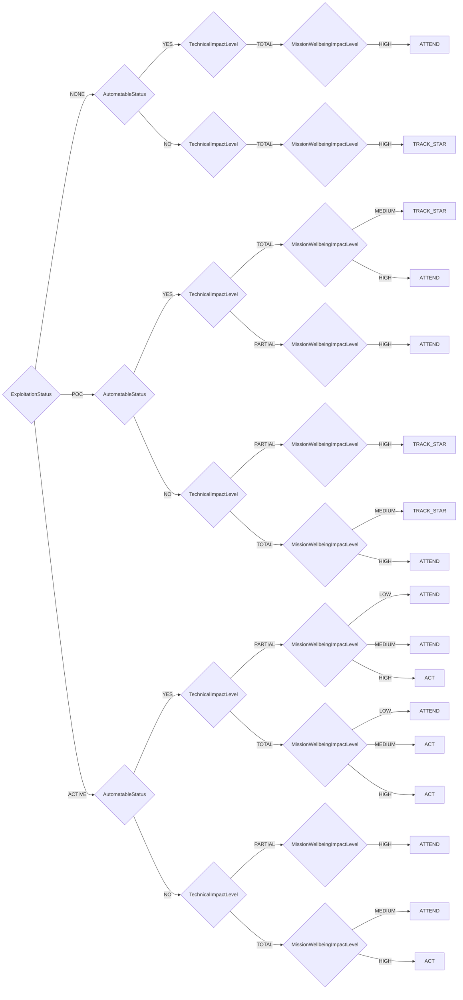

# CISA Decision Model

CISA Stakeholder-Specific Vulnerability Categorization

**Version:** 1.0  
**Reference:** [https://www.cisa.gov/stakeholder-specific-vulnerability-categorization-ssvc](https://www.cisa.gov/stakeholder-specific-vulnerability-categorization-ssvc)

## Decision Tree



## Decision Points

- **ExploitationStatus**: `NONE`, `POC`, `ACTIVE`
- **AutomatableStatus**: `YES`, `NO`
- **TechnicalImpactLevel**: `PARTIAL`, `TOTAL`
- **MissionWellbeingImpactLevel**: `LOW`, `MEDIUM`, `HIGH`

## Usage

```python
from ssvc.plugins.cisa import DecisionCisa

decision = DecisionCisa(
    # Set decision point values here
)

outcome = decision.evaluate()
print(f"Action: {outcome.action}")
print(f"Priority: {outcome.priority}")
```