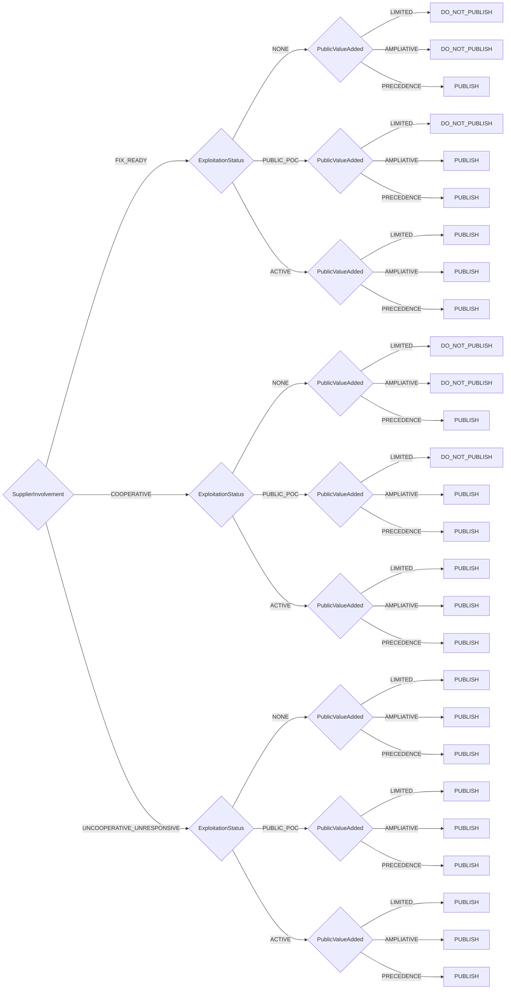

# Coordinator Publication Decision Model Decision Model

CERT/CC Coordinator Publication Decision Model for determining vulnerability disclosure

**Version:** 1.0  
**Reference:** [https://certcc.github.io/SSVC/howto/publication_decision/](https://certcc.github.io/SSVC/howto/publication_decision/)

## Decision Tree



## Decision Points

- **SupplierInvolvement**: `FIX_READY`, `COOPERATIVE`, `UNCOOPERATIVE_UNRESPONSIVE`
- **ExploitationStatus**: `NONE`, `PUBLIC_POC`, `ACTIVE`
- **PublicValueAdded**: `LIMITED`, `AMPLIATIVE`, `PRECEDENCE`

## Usage

```python
from ssvc.plugins.coordinator_publication import DecisionCoordinatorPublication

decision = DecisionCoordinatorPublication(
    # Set decision point values here
)

outcome = decision.evaluate()
print(f"Action: {outcome.action}")
print(f"Priority: {outcome.priority}")
```