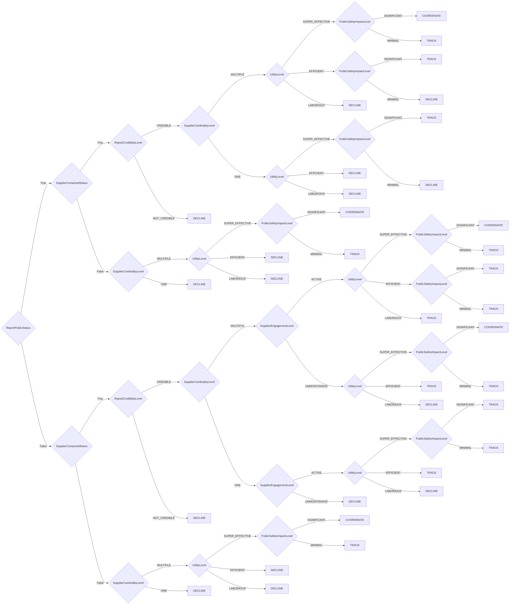

# Coordinator Triage Decision Model

CERT/CC Coordinator Triage Decision Model

**Version:** 1.0  
**Reference:** [https://certcc.github.io/SSVC/howto/coordination_triage_decision/](https://certcc.github.io/SSVC/howto/coordination_triage_decision/)

## Decision Tree



## Decision Points

- **ReportPublicStatus**: `YES`, `NO`
- **SupplierContactedStatus**: `YES`, `NO`
- **ReportCredibilityLevel**: `CREDIBLE`, `NOT_CREDIBLE`
- **SupplierCardinalityLevel**: `ONE`, `MULTIPLE`
- **SupplierEngagementLevel**: `ACTIVE`, `UNRESPONSIVE`
- **UtilityLevel**: `LABORIOUS`, `EFFICIENT`, `SUPER_EFFECTIVE`
- **PublicSafetyImpactLevel**: `MINIMAL`, `SIGNIFICANT`

## Usage

```python
from ssvc.plugins.coordinator_triage import DecisionCoordinatorTriage

decision = DecisionCoordinatorTriage(
    # Set decision point values here
)

outcome = decision.evaluate()
print(f"Action: {outcome.action}")
print(f"Priority: {outcome.priority}")
```