# Deployer Decision Model Decision Model

CERT/CC Deployer Decision Model for prioritizing patch deployment

**Version:** 1.0  
**Reference:** [https://certcc.github.io/SSVC/howto/deployer_tree/](https://certcc.github.io/SSVC/howto/deployer_tree/)

## Decision Tree

```mermaid
flowchart LR
    ExploitationStatus_1{ExploitationStatus}
    SystemExposureLevel_2{SystemExposureLevel}
    ExploitationStatus_1 -->|NONE| SystemExposureLevel_2
    UtilityLevel_3{UtilityLevel}
    SystemExposureLevel_2 -->|SMALL| UtilityLevel_3
    HumanImpactLevel_4{HumanImpactLevel}
    UtilityLevel_3 -->|LABORIOUS| HumanImpactLevel_4
    Action_DEFER_5[DEFER]
    HumanImpactLevel_4 -->|LOW| Action_DEFER_5
    Action_DEFER_6[DEFER]
    HumanImpactLevel_4 -->|MEDIUM| Action_DEFER_6
    Action_DEFER_7[DEFER]
    HumanImpactLevel_4 -->|HIGH| Action_DEFER_7
    Action_SCHEDULED_8[SCHEDULED]
    HumanImpactLevel_4 -->|VERY_HIGH| Action_SCHEDULED_8
    HumanImpactLevel_9{HumanImpactLevel}
    UtilityLevel_3 -->|EFFICIENT| HumanImpactLevel_9
    Action_DEFER_10[DEFER]
    HumanImpactLevel_9 -->|LOW| Action_DEFER_10
    Action_DEFER_11[DEFER]
    HumanImpactLevel_9 -->|MEDIUM| Action_DEFER_11
    Action_SCHEDULED_12[SCHEDULED]
    HumanImpactLevel_9 -->|HIGH| Action_SCHEDULED_12
    Action_SCHEDULED_13[SCHEDULED]
    HumanImpactLevel_9 -->|VERY_HIGH| Action_SCHEDULED_13
    HumanImpactLevel_14{HumanImpactLevel}
    UtilityLevel_3 -->|SUPER_EFFECTIVE| HumanImpactLevel_14
    Action_DEFER_15[DEFER]
    HumanImpactLevel_14 -->|LOW| Action_DEFER_15
    Action_SCHEDULED_16[SCHEDULED]
    HumanImpactLevel_14 -->|MEDIUM| Action_SCHEDULED_16
    Action_SCHEDULED_17[SCHEDULED]
    HumanImpactLevel_14 -->|HIGH| Action_SCHEDULED_17
    Action_OUT_OF_CYCLE_18[OUT_OF_CYCLE]
    HumanImpactLevel_14 -->|VERY_HIGH| Action_OUT_OF_CYCLE_18
    UtilityLevel_19{UtilityLevel}
    SystemExposureLevel_2 -->|CONTROLLED| UtilityLevel_19
    HumanImpactLevel_20{HumanImpactLevel}
    UtilityLevel_19 -->|LABORIOUS| HumanImpactLevel_20
    Action_DEFER_21[DEFER]
    HumanImpactLevel_20 -->|LOW| Action_DEFER_21
    Action_DEFER_22[DEFER]
    HumanImpactLevel_20 -->|MEDIUM| Action_DEFER_22
    Action_SCHEDULED_23[SCHEDULED]
    HumanImpactLevel_20 -->|HIGH| Action_SCHEDULED_23
    Action_SCHEDULED_24[SCHEDULED]
    HumanImpactLevel_20 -->|VERY_HIGH| Action_SCHEDULED_24
    HumanImpactLevel_25{HumanImpactLevel}
    UtilityLevel_19 -->|EFFICIENT| HumanImpactLevel_25
    Action_DEFER_26[DEFER]
    HumanImpactLevel_25 -->|LOW| Action_DEFER_26
    Action_SCHEDULED_27[SCHEDULED]
    HumanImpactLevel_25 -->|MEDIUM| Action_SCHEDULED_27
    Action_SCHEDULED_28[SCHEDULED]
    HumanImpactLevel_25 -->|HIGH| Action_SCHEDULED_28
    Action_OUT_OF_CYCLE_29[OUT_OF_CYCLE]
    HumanImpactLevel_25 -->|VERY_HIGH| Action_OUT_OF_CYCLE_29
    HumanImpactLevel_30{HumanImpactLevel}
    UtilityLevel_19 -->|SUPER_EFFECTIVE| HumanImpactLevel_30
    Action_SCHEDULED_31[SCHEDULED]
    HumanImpactLevel_30 -->|LOW| Action_SCHEDULED_31
    Action_SCHEDULED_32[SCHEDULED]
    HumanImpactLevel_30 -->|MEDIUM| Action_SCHEDULED_32
    Action_OUT_OF_CYCLE_33[OUT_OF_CYCLE]
    HumanImpactLevel_30 -->|HIGH| Action_OUT_OF_CYCLE_33
    Action_OUT_OF_CYCLE_34[OUT_OF_CYCLE]
    HumanImpactLevel_30 -->|VERY_HIGH| Action_OUT_OF_CYCLE_34
    UtilityLevel_35{UtilityLevel}
    SystemExposureLevel_2 -->|OPEN| UtilityLevel_35
    HumanImpactLevel_36{HumanImpactLevel}
    UtilityLevel_35 -->|LABORIOUS| HumanImpactLevel_36
    Action_DEFER_37[DEFER]
    HumanImpactLevel_36 -->|LOW| Action_DEFER_37
    Action_SCHEDULED_38[SCHEDULED]
    HumanImpactLevel_36 -->|MEDIUM| Action_SCHEDULED_38
    Action_SCHEDULED_39[SCHEDULED]
    HumanImpactLevel_36 -->|HIGH| Action_SCHEDULED_39
    Action_OUT_OF_CYCLE_40[OUT_OF_CYCLE]
    HumanImpactLevel_36 -->|VERY_HIGH| Action_OUT_OF_CYCLE_40
    HumanImpactLevel_41{HumanImpactLevel}
    UtilityLevel_35 -->|EFFICIENT| HumanImpactLevel_41
    Action_SCHEDULED_42[SCHEDULED]
    HumanImpactLevel_41 -->|LOW| Action_SCHEDULED_42
    Action_SCHEDULED_43[SCHEDULED]
    HumanImpactLevel_41 -->|MEDIUM| Action_SCHEDULED_43
    Action_OUT_OF_CYCLE_44[OUT_OF_CYCLE]
    HumanImpactLevel_41 -->|HIGH| Action_OUT_OF_CYCLE_44
    Action_OUT_OF_CYCLE_45[OUT_OF_CYCLE]
    HumanImpactLevel_41 -->|VERY_HIGH| Action_OUT_OF_CYCLE_45
    HumanImpactLevel_46{HumanImpactLevel}
    UtilityLevel_35 -->|SUPER_EFFECTIVE| HumanImpactLevel_46
    Action_SCHEDULED_47[SCHEDULED]
    HumanImpactLevel_46 -->|LOW| Action_SCHEDULED_47
    Action_OUT_OF_CYCLE_48[OUT_OF_CYCLE]
    HumanImpactLevel_46 -->|MEDIUM| Action_OUT_OF_CYCLE_48
    Action_OUT_OF_CYCLE_49[OUT_OF_CYCLE]
    HumanImpactLevel_46 -->|HIGH| Action_OUT_OF_CYCLE_49
    Action_IMMEDIATE_50[IMMEDIATE]
    HumanImpactLevel_46 -->|VERY_HIGH| Action_IMMEDIATE_50
    SystemExposureLevel_51{SystemExposureLevel}
    ExploitationStatus_1 -->|POC| SystemExposureLevel_51
    UtilityLevel_52{UtilityLevel}
    SystemExposureLevel_51 -->|SMALL| UtilityLevel_52
    HumanImpactLevel_53{HumanImpactLevel}
    UtilityLevel_52 -->|LABORIOUS| HumanImpactLevel_53
    Action_DEFER_54[DEFER]
    HumanImpactLevel_53 -->|LOW| Action_DEFER_54
    Action_DEFER_55[DEFER]
    HumanImpactLevel_53 -->|MEDIUM| Action_DEFER_55
    Action_SCHEDULED_56[SCHEDULED]
    HumanImpactLevel_53 -->|HIGH| Action_SCHEDULED_56
    Action_SCHEDULED_57[SCHEDULED]
    HumanImpactLevel_53 -->|VERY_HIGH| Action_SCHEDULED_57
    HumanImpactLevel_58{HumanImpactLevel}
    UtilityLevel_52 -->|EFFICIENT| HumanImpactLevel_58
    Action_DEFER_59[DEFER]
    HumanImpactLevel_58 -->|LOW| Action_DEFER_59
    Action_SCHEDULED_60[SCHEDULED]
    HumanImpactLevel_58 -->|MEDIUM| Action_SCHEDULED_60
    Action_SCHEDULED_61[SCHEDULED]
    HumanImpactLevel_58 -->|HIGH| Action_SCHEDULED_61
    Action_OUT_OF_CYCLE_62[OUT_OF_CYCLE]
    HumanImpactLevel_58 -->|VERY_HIGH| Action_OUT_OF_CYCLE_62
    HumanImpactLevel_63{HumanImpactLevel}
    UtilityLevel_52 -->|SUPER_EFFECTIVE| HumanImpactLevel_63
    Action_SCHEDULED_64[SCHEDULED]
    HumanImpactLevel_63 -->|LOW| Action_SCHEDULED_64
    Action_SCHEDULED_65[SCHEDULED]
    HumanImpactLevel_63 -->|MEDIUM| Action_SCHEDULED_65
    Action_OUT_OF_CYCLE_66[OUT_OF_CYCLE]
    HumanImpactLevel_63 -->|HIGH| Action_OUT_OF_CYCLE_66
    Action_OUT_OF_CYCLE_67[OUT_OF_CYCLE]
    HumanImpactLevel_63 -->|VERY_HIGH| Action_OUT_OF_CYCLE_67
    UtilityLevel_68{UtilityLevel}
    SystemExposureLevel_51 -->|CONTROLLED| UtilityLevel_68
    HumanImpactLevel_69{HumanImpactLevel}
    UtilityLevel_68 -->|LABORIOUS| HumanImpactLevel_69
    Action_DEFER_70[DEFER]
    HumanImpactLevel_69 -->|LOW| Action_DEFER_70
    Action_SCHEDULED_71[SCHEDULED]
    HumanImpactLevel_69 -->|MEDIUM| Action_SCHEDULED_71
    Action_SCHEDULED_72[SCHEDULED]
    HumanImpactLevel_69 -->|HIGH| Action_SCHEDULED_72
    Action_OUT_OF_CYCLE_73[OUT_OF_CYCLE]
    HumanImpactLevel_69 -->|VERY_HIGH| Action_OUT_OF_CYCLE_73
    HumanImpactLevel_74{HumanImpactLevel}
    UtilityLevel_68 -->|EFFICIENT| HumanImpactLevel_74
    Action_SCHEDULED_75[SCHEDULED]
    HumanImpactLevel_74 -->|LOW| Action_SCHEDULED_75
    Action_SCHEDULED_76[SCHEDULED]
    HumanImpactLevel_74 -->|MEDIUM| Action_SCHEDULED_76
    Action_OUT_OF_CYCLE_77[OUT_OF_CYCLE]
    HumanImpactLevel_74 -->|HIGH| Action_OUT_OF_CYCLE_77
    Action_OUT_OF_CYCLE_78[OUT_OF_CYCLE]
    HumanImpactLevel_74 -->|VERY_HIGH| Action_OUT_OF_CYCLE_78
    HumanImpactLevel_79{HumanImpactLevel}
    UtilityLevel_68 -->|SUPER_EFFECTIVE| HumanImpactLevel_79
    Action_SCHEDULED_80[SCHEDULED]
    HumanImpactLevel_79 -->|LOW| Action_SCHEDULED_80
    Action_OUT_OF_CYCLE_81[OUT_OF_CYCLE]
    HumanImpactLevel_79 -->|MEDIUM| Action_OUT_OF_CYCLE_81
    Action_OUT_OF_CYCLE_82[OUT_OF_CYCLE]
    HumanImpactLevel_79 -->|HIGH| Action_OUT_OF_CYCLE_82
    Action_IMMEDIATE_83[IMMEDIATE]
    HumanImpactLevel_79 -->|VERY_HIGH| Action_IMMEDIATE_83
    UtilityLevel_84{UtilityLevel}
    SystemExposureLevel_51 -->|OPEN| UtilityLevel_84
    HumanImpactLevel_85{HumanImpactLevel}
    UtilityLevel_84 -->|LABORIOUS| HumanImpactLevel_85
    Action_SCHEDULED_86[SCHEDULED]
    HumanImpactLevel_85 -->|LOW| Action_SCHEDULED_86
    Action_SCHEDULED_87[SCHEDULED]
    HumanImpactLevel_85 -->|MEDIUM| Action_SCHEDULED_87
    Action_OUT_OF_CYCLE_88[OUT_OF_CYCLE]
    HumanImpactLevel_85 -->|HIGH| Action_OUT_OF_CYCLE_88
    Action_OUT_OF_CYCLE_89[OUT_OF_CYCLE]
    HumanImpactLevel_85 -->|VERY_HIGH| Action_OUT_OF_CYCLE_89
    HumanImpactLevel_90{HumanImpactLevel}
    UtilityLevel_84 -->|EFFICIENT| HumanImpactLevel_90
    Action_SCHEDULED_91[SCHEDULED]
    HumanImpactLevel_90 -->|LOW| Action_SCHEDULED_91
    Action_OUT_OF_CYCLE_92[OUT_OF_CYCLE]
    HumanImpactLevel_90 -->|MEDIUM| Action_OUT_OF_CYCLE_92
    Action_OUT_OF_CYCLE_93[OUT_OF_CYCLE]
    HumanImpactLevel_90 -->|HIGH| Action_OUT_OF_CYCLE_93
    Action_IMMEDIATE_94[IMMEDIATE]
    HumanImpactLevel_90 -->|VERY_HIGH| Action_IMMEDIATE_94
    HumanImpactLevel_95{HumanImpactLevel}
    UtilityLevel_84 -->|SUPER_EFFECTIVE| HumanImpactLevel_95
    Action_OUT_OF_CYCLE_96[OUT_OF_CYCLE]
    HumanImpactLevel_95 -->|LOW| Action_OUT_OF_CYCLE_96
    Action_OUT_OF_CYCLE_97[OUT_OF_CYCLE]
    HumanImpactLevel_95 -->|MEDIUM| Action_OUT_OF_CYCLE_97
    Action_IMMEDIATE_98[IMMEDIATE]
    HumanImpactLevel_95 -->|HIGH| Action_IMMEDIATE_98
    Action_IMMEDIATE_99[IMMEDIATE]
    HumanImpactLevel_95 -->|VERY_HIGH| Action_IMMEDIATE_99
    SystemExposureLevel_100{SystemExposureLevel}
    ExploitationStatus_1 -->|ACTIVE| SystemExposureLevel_100
    UtilityLevel_101{UtilityLevel}
    SystemExposureLevel_100 -->|SMALL| UtilityLevel_101
    HumanImpactLevel_102{HumanImpactLevel}
    UtilityLevel_101 -->|LABORIOUS| HumanImpactLevel_102
    Action_SCHEDULED_103[SCHEDULED]
    HumanImpactLevel_102 -->|LOW| Action_SCHEDULED_103
    Action_SCHEDULED_104[SCHEDULED]
    HumanImpactLevel_102 -->|MEDIUM| Action_SCHEDULED_104
    Action_SCHEDULED_105[SCHEDULED]
    HumanImpactLevel_102 -->|HIGH| Action_SCHEDULED_105
    Action_OUT_OF_CYCLE_106[OUT_OF_CYCLE]
    HumanImpactLevel_102 -->|VERY_HIGH| Action_OUT_OF_CYCLE_106
    HumanImpactLevel_107{HumanImpactLevel}
    UtilityLevel_101 -->|EFFICIENT| HumanImpactLevel_107
    Action_SCHEDULED_108[SCHEDULED]
    HumanImpactLevel_107 -->|LOW| Action_SCHEDULED_108
    Action_SCHEDULED_109[SCHEDULED]
    HumanImpactLevel_107 -->|MEDIUM| Action_SCHEDULED_109
    Action_OUT_OF_CYCLE_110[OUT_OF_CYCLE]
    HumanImpactLevel_107 -->|HIGH| Action_OUT_OF_CYCLE_110
    Action_OUT_OF_CYCLE_111[OUT_OF_CYCLE]
    HumanImpactLevel_107 -->|VERY_HIGH| Action_OUT_OF_CYCLE_111
    HumanImpactLevel_112{HumanImpactLevel}
    UtilityLevel_101 -->|SUPER_EFFECTIVE| HumanImpactLevel_112
    Action_SCHEDULED_113[SCHEDULED]
    HumanImpactLevel_112 -->|LOW| Action_SCHEDULED_113
    Action_OUT_OF_CYCLE_114[OUT_OF_CYCLE]
    HumanImpactLevel_112 -->|MEDIUM| Action_OUT_OF_CYCLE_114
    Action_OUT_OF_CYCLE_115[OUT_OF_CYCLE]
    HumanImpactLevel_112 -->|HIGH| Action_OUT_OF_CYCLE_115
    Action_IMMEDIATE_116[IMMEDIATE]
    HumanImpactLevel_112 -->|VERY_HIGH| Action_IMMEDIATE_116
    UtilityLevel_117{UtilityLevel}
    SystemExposureLevel_100 -->|CONTROLLED| UtilityLevel_117
    HumanImpactLevel_118{HumanImpactLevel}
    UtilityLevel_117 -->|LABORIOUS| HumanImpactLevel_118
    Action_SCHEDULED_119[SCHEDULED]
    HumanImpactLevel_118 -->|LOW| Action_SCHEDULED_119
    Action_SCHEDULED_120[SCHEDULED]
    HumanImpactLevel_118 -->|MEDIUM| Action_SCHEDULED_120
    Action_OUT_OF_CYCLE_121[OUT_OF_CYCLE]
    HumanImpactLevel_118 -->|HIGH| Action_OUT_OF_CYCLE_121
    Action_OUT_OF_CYCLE_122[OUT_OF_CYCLE]
    HumanImpactLevel_118 -->|VERY_HIGH| Action_OUT_OF_CYCLE_122
    HumanImpactLevel_123{HumanImpactLevel}
    UtilityLevel_117 -->|EFFICIENT| HumanImpactLevel_123
    Action_SCHEDULED_124[SCHEDULED]
    HumanImpactLevel_123 -->|LOW| Action_SCHEDULED_124
    Action_OUT_OF_CYCLE_125[OUT_OF_CYCLE]
    HumanImpactLevel_123 -->|MEDIUM| Action_OUT_OF_CYCLE_125
    Action_OUT_OF_CYCLE_126[OUT_OF_CYCLE]
    HumanImpactLevel_123 -->|HIGH| Action_OUT_OF_CYCLE_126
    Action_IMMEDIATE_127[IMMEDIATE]
    HumanImpactLevel_123 -->|VERY_HIGH| Action_IMMEDIATE_127
    HumanImpactLevel_128{HumanImpactLevel}
    UtilityLevel_117 -->|SUPER_EFFECTIVE| HumanImpactLevel_128
    Action_OUT_OF_CYCLE_129[OUT_OF_CYCLE]
    HumanImpactLevel_128 -->|LOW| Action_OUT_OF_CYCLE_129
    Action_OUT_OF_CYCLE_130[OUT_OF_CYCLE]
    HumanImpactLevel_128 -->|MEDIUM| Action_OUT_OF_CYCLE_130
    Action_IMMEDIATE_131[IMMEDIATE]
    HumanImpactLevel_128 -->|HIGH| Action_IMMEDIATE_131
    Action_IMMEDIATE_132[IMMEDIATE]
    HumanImpactLevel_128 -->|VERY_HIGH| Action_IMMEDIATE_132
    UtilityLevel_133{UtilityLevel}
    SystemExposureLevel_100 -->|OPEN| UtilityLevel_133
    HumanImpactLevel_134{HumanImpactLevel}
    UtilityLevel_133 -->|LABORIOUS| HumanImpactLevel_134
    Action_SCHEDULED_135[SCHEDULED]
    HumanImpactLevel_134 -->|LOW| Action_SCHEDULED_135
    Action_OUT_OF_CYCLE_136[OUT_OF_CYCLE]
    HumanImpactLevel_134 -->|MEDIUM| Action_OUT_OF_CYCLE_136
    Action_OUT_OF_CYCLE_137[OUT_OF_CYCLE]
    HumanImpactLevel_134 -->|HIGH| Action_OUT_OF_CYCLE_137
    Action_IMMEDIATE_138[IMMEDIATE]
    HumanImpactLevel_134 -->|VERY_HIGH| Action_IMMEDIATE_138
    HumanImpactLevel_139{HumanImpactLevel}
    UtilityLevel_133 -->|EFFICIENT| HumanImpactLevel_139
    Action_OUT_OF_CYCLE_140[OUT_OF_CYCLE]
    HumanImpactLevel_139 -->|LOW| Action_OUT_OF_CYCLE_140
    Action_OUT_OF_CYCLE_141[OUT_OF_CYCLE]
    HumanImpactLevel_139 -->|MEDIUM| Action_OUT_OF_CYCLE_141
    Action_IMMEDIATE_142[IMMEDIATE]
    HumanImpactLevel_139 -->|HIGH| Action_IMMEDIATE_142
    Action_IMMEDIATE_143[IMMEDIATE]
    HumanImpactLevel_139 -->|VERY_HIGH| Action_IMMEDIATE_143
    HumanImpactLevel_144{HumanImpactLevel}
    UtilityLevel_133 -->|SUPER_EFFECTIVE| HumanImpactLevel_144
    Action_OUT_OF_CYCLE_145[OUT_OF_CYCLE]
    HumanImpactLevel_144 -->|LOW| Action_OUT_OF_CYCLE_145
    Action_IMMEDIATE_146[IMMEDIATE]
    HumanImpactLevel_144 -->|MEDIUM| Action_IMMEDIATE_146
    Action_IMMEDIATE_147[IMMEDIATE]
    HumanImpactLevel_144 -->|HIGH| Action_IMMEDIATE_147
    Action_IMMEDIATE_148[IMMEDIATE]
    HumanImpactLevel_144 -->|VERY_HIGH| Action_IMMEDIATE_148
```



## Decision Points

- **ExploitationStatus**: `NONE`, `POC`, `ACTIVE`
- **SystemExposureLevel**: `SMALL`, `CONTROLLED`, `OPEN`
- **UtilityLevel**: `LABORIOUS`, `EFFICIENT`, `SUPER_EFFECTIVE`
- **HumanImpactLevel**: `LOW`, `MEDIUM`, `HIGH`, `VERY_HIGH`

## Usage

```python
from ssvc.plugins.deployer import DecisionDeployer

decision = DecisionDeployer(
    # Set decision point values here
)

outcome = decision.evaluate()
print(f"Action: {outcome.action}")
print(f"Priority: {outcome.priority}")
```