# Supplier Decision Model Decision Model

CERT/CC Supplier Decision Model for prioritizing patch creation

**Version:** 1.0  
**Reference:** [https://certcc.github.io/SSVC/howto/supplier_tree/](https://certcc.github.io/SSVC/howto/supplier_tree/)

## Decision Tree

```mermaid
flowchart LR
    ExploitationStatus_1{ExploitationStatus}
    UtilityLevel_2{UtilityLevel}
    ExploitationStatus_1 -->|NONE| UtilityLevel_2
    TechnicalImpactLevel_3{TechnicalImpactLevel}
    UtilityLevel_2 -->|LABORIOUS| TechnicalImpactLevel_3
    PublicSafetyImpactLevel_4{PublicSafetyImpactLevel}
    TechnicalImpactLevel_3 -->|PARTIAL| PublicSafetyImpactLevel_4
    Action_DEFER_5[DEFER]
    PublicSafetyImpactLevel_4 -->|MINIMAL| Action_DEFER_5
    Action_DEFER_6[DEFER]
    PublicSafetyImpactLevel_4 -->|SIGNIFICANT| Action_DEFER_6
    PublicSafetyImpactLevel_7{PublicSafetyImpactLevel}
    TechnicalImpactLevel_3 -->|TOTAL| PublicSafetyImpactLevel_7
    Action_DEFER_8[DEFER]
    PublicSafetyImpactLevel_7 -->|MINIMAL| Action_DEFER_8
    Action_DEFER_9[DEFER]
    PublicSafetyImpactLevel_7 -->|SIGNIFICANT| Action_DEFER_9
    TechnicalImpactLevel_10{TechnicalImpactLevel}
    UtilityLevel_2 -->|EFFICIENT| TechnicalImpactLevel_10
    PublicSafetyImpactLevel_11{PublicSafetyImpactLevel}
    TechnicalImpactLevel_10 -->|PARTIAL| PublicSafetyImpactLevel_11
    Action_DEFER_12[DEFER]
    PublicSafetyImpactLevel_11 -->|MINIMAL| Action_DEFER_12
    Action_SCHEDULED_13[SCHEDULED]
    PublicSafetyImpactLevel_11 -->|SIGNIFICANT| Action_SCHEDULED_13
    PublicSafetyImpactLevel_14{PublicSafetyImpactLevel}
    TechnicalImpactLevel_10 -->|TOTAL| PublicSafetyImpactLevel_14
    Action_SCHEDULED_15[SCHEDULED]
    PublicSafetyImpactLevel_14 -->|MINIMAL| Action_SCHEDULED_15
    Action_SCHEDULED_16[SCHEDULED]
    PublicSafetyImpactLevel_14 -->|SIGNIFICANT| Action_SCHEDULED_16
    TechnicalImpactLevel_17{TechnicalImpactLevel}
    UtilityLevel_2 -->|SUPER_EFFECTIVE| TechnicalImpactLevel_17
    PublicSafetyImpactLevel_18{PublicSafetyImpactLevel}
    TechnicalImpactLevel_17 -->|PARTIAL| PublicSafetyImpactLevel_18
    Action_SCHEDULED_19[SCHEDULED]
    PublicSafetyImpactLevel_18 -->|MINIMAL| Action_SCHEDULED_19
    Action_OUT_OF_CYCLE_20[OUT_OF_CYCLE]
    PublicSafetyImpactLevel_18 -->|SIGNIFICANT| Action_OUT_OF_CYCLE_20
    PublicSafetyImpactLevel_21{PublicSafetyImpactLevel}
    TechnicalImpactLevel_17 -->|TOTAL| PublicSafetyImpactLevel_21
    Action_OUT_OF_CYCLE_22[OUT_OF_CYCLE]
    PublicSafetyImpactLevel_21 -->|MINIMAL| Action_OUT_OF_CYCLE_22
    Action_IMMEDIATE_23[IMMEDIATE]
    PublicSafetyImpactLevel_21 -->|SIGNIFICANT| Action_IMMEDIATE_23
    UtilityLevel_24{UtilityLevel}
    ExploitationStatus_1 -->|POC| UtilityLevel_24
    TechnicalImpactLevel_25{TechnicalImpactLevel}
    UtilityLevel_24 -->|LABORIOUS| TechnicalImpactLevel_25
    PublicSafetyImpactLevel_26{PublicSafetyImpactLevel}
    TechnicalImpactLevel_25 -->|PARTIAL| PublicSafetyImpactLevel_26
    Action_DEFER_27[DEFER]
    PublicSafetyImpactLevel_26 -->|MINIMAL| Action_DEFER_27
    Action_DEFER_28[DEFER]
    PublicSafetyImpactLevel_26 -->|SIGNIFICANT| Action_DEFER_28
    PublicSafetyImpactLevel_29{PublicSafetyImpactLevel}
    TechnicalImpactLevel_25 -->|TOTAL| PublicSafetyImpactLevel_29
    Action_DEFER_30[DEFER]
    PublicSafetyImpactLevel_29 -->|MINIMAL| Action_DEFER_30
    Action_SCHEDULED_31[SCHEDULED]
    PublicSafetyImpactLevel_29 -->|SIGNIFICANT| Action_SCHEDULED_31
    TechnicalImpactLevel_32{TechnicalImpactLevel}
    UtilityLevel_24 -->|EFFICIENT| TechnicalImpactLevel_32
    PublicSafetyImpactLevel_33{PublicSafetyImpactLevel}
    TechnicalImpactLevel_32 -->|PARTIAL| PublicSafetyImpactLevel_33
    Action_DEFER_34[DEFER]
    PublicSafetyImpactLevel_33 -->|MINIMAL| Action_DEFER_34
    Action_SCHEDULED_35[SCHEDULED]
    PublicSafetyImpactLevel_33 -->|SIGNIFICANT| Action_SCHEDULED_35
    PublicSafetyImpactLevel_36{PublicSafetyImpactLevel}
    TechnicalImpactLevel_32 -->|TOTAL| PublicSafetyImpactLevel_36
    Action_SCHEDULED_37[SCHEDULED]
    PublicSafetyImpactLevel_36 -->|MINIMAL| Action_SCHEDULED_37
    Action_OUT_OF_CYCLE_38[OUT_OF_CYCLE]
    PublicSafetyImpactLevel_36 -->|SIGNIFICANT| Action_OUT_OF_CYCLE_38
    TechnicalImpactLevel_39{TechnicalImpactLevel}
    UtilityLevel_24 -->|SUPER_EFFECTIVE| TechnicalImpactLevel_39
    PublicSafetyImpactLevel_40{PublicSafetyImpactLevel}
    TechnicalImpactLevel_39 -->|PARTIAL| PublicSafetyImpactLevel_40
    Action_SCHEDULED_41[SCHEDULED]
    PublicSafetyImpactLevel_40 -->|MINIMAL| Action_SCHEDULED_41
    Action_OUT_OF_CYCLE_42[OUT_OF_CYCLE]
    PublicSafetyImpactLevel_40 -->|SIGNIFICANT| Action_OUT_OF_CYCLE_42
    PublicSafetyImpactLevel_43{PublicSafetyImpactLevel}
    TechnicalImpactLevel_39 -->|TOTAL| PublicSafetyImpactLevel_43
    Action_OUT_OF_CYCLE_44[OUT_OF_CYCLE]
    PublicSafetyImpactLevel_43 -->|MINIMAL| Action_OUT_OF_CYCLE_44
    Action_IMMEDIATE_45[IMMEDIATE]
    PublicSafetyImpactLevel_43 -->|SIGNIFICANT| Action_IMMEDIATE_45
    UtilityLevel_46{UtilityLevel}
    ExploitationStatus_1 -->|ACTIVE| UtilityLevel_46
    TechnicalImpactLevel_47{TechnicalImpactLevel}
    UtilityLevel_46 -->|LABORIOUS| TechnicalImpactLevel_47
    PublicSafetyImpactLevel_48{PublicSafetyImpactLevel}
    TechnicalImpactLevel_47 -->|PARTIAL| PublicSafetyImpactLevel_48
    Action_DEFER_49[DEFER]
    PublicSafetyImpactLevel_48 -->|MINIMAL| Action_DEFER_49
    Action_SCHEDULED_50[SCHEDULED]
    PublicSafetyImpactLevel_48 -->|SIGNIFICANT| Action_SCHEDULED_50
    PublicSafetyImpactLevel_51{PublicSafetyImpactLevel}
    TechnicalImpactLevel_47 -->|TOTAL| PublicSafetyImpactLevel_51
    Action_SCHEDULED_52[SCHEDULED]
    PublicSafetyImpactLevel_51 -->|MINIMAL| Action_SCHEDULED_52
    Action_SCHEDULED_53[SCHEDULED]
    PublicSafetyImpactLevel_51 -->|SIGNIFICANT| Action_SCHEDULED_53
    TechnicalImpactLevel_54{TechnicalImpactLevel}
    UtilityLevel_46 -->|EFFICIENT| TechnicalImpactLevel_54
    PublicSafetyImpactLevel_55{PublicSafetyImpactLevel}
    TechnicalImpactLevel_54 -->|PARTIAL| PublicSafetyImpactLevel_55
    Action_SCHEDULED_56[SCHEDULED]
    PublicSafetyImpactLevel_55 -->|MINIMAL| Action_SCHEDULED_56
    Action_OUT_OF_CYCLE_57[OUT_OF_CYCLE]
    PublicSafetyImpactLevel_55 -->|SIGNIFICANT| Action_OUT_OF_CYCLE_57
    PublicSafetyImpactLevel_58{PublicSafetyImpactLevel}
    TechnicalImpactLevel_54 -->|TOTAL| PublicSafetyImpactLevel_58
    Action_OUT_OF_CYCLE_59[OUT_OF_CYCLE]
    PublicSafetyImpactLevel_58 -->|MINIMAL| Action_OUT_OF_CYCLE_59
    Action_IMMEDIATE_60[IMMEDIATE]
    PublicSafetyImpactLevel_58 -->|SIGNIFICANT| Action_IMMEDIATE_60
    TechnicalImpactLevel_61{TechnicalImpactLevel}
    UtilityLevel_46 -->|SUPER_EFFECTIVE| TechnicalImpactLevel_61
    PublicSafetyImpactLevel_62{PublicSafetyImpactLevel}
    TechnicalImpactLevel_61 -->|PARTIAL| PublicSafetyImpactLevel_62
    Action_OUT_OF_CYCLE_63[OUT_OF_CYCLE]
    PublicSafetyImpactLevel_62 -->|MINIMAL| Action_OUT_OF_CYCLE_63
    Action_IMMEDIATE_64[IMMEDIATE]
    PublicSafetyImpactLevel_62 -->|SIGNIFICANT| Action_IMMEDIATE_64
    PublicSafetyImpactLevel_65{PublicSafetyImpactLevel}
    TechnicalImpactLevel_61 -->|TOTAL| PublicSafetyImpactLevel_65
    Action_IMMEDIATE_66[IMMEDIATE]
    PublicSafetyImpactLevel_65 -->|MINIMAL| Action_IMMEDIATE_66
    Action_IMMEDIATE_67[IMMEDIATE]
    PublicSafetyImpactLevel_65 -->|SIGNIFICANT| Action_IMMEDIATE_67
```



## Decision Points

- **ExploitationStatus**: `NONE`, `POC`, `ACTIVE`
- **UtilityLevel**: `LABORIOUS`, `EFFICIENT`, `SUPER_EFFECTIVE`
- **TechnicalImpactLevel**: `PARTIAL`, `TOTAL`
- **PublicSafetyImpactLevel**: `MINIMAL`, `SIGNIFICANT`

## Usage

```python
from ssvc.plugins.supplier import DecisionSupplier

decision = DecisionSupplier(
    # Set decision point values here
)

outcome = decision.evaluate()
print(f"Action: {outcome.action}")
print(f"Priority: {outcome.priority}")
```