# Supplier Decision Model

CERT/CC Supplier Decision Model

> **⚠️ DO NOT EDIT THIS FILE DIRECTLY**  
> This file is auto-generated. To make changes:
> 1. Edit the source YAML file: `methodologies/supplier.yaml`
> 2. Run: `uv run python scripts/generate_plugins.py`

**Version:** 1.0  
**Reference:** [https://certcc.github.io/SSVC/howto/supplier_tree/](https://certcc.github.io/SSVC/howto/supplier_tree/)

## Decision Tree

```mermaid
flowchart LR
    ExploitationStatus_1{ExploitationStatus}
    UtilityLevel_2{UtilityLevel}
    ExploitationStatus_1 -->|none| UtilityLevel_2
    TechnicalImpactLevel_3{TechnicalImpactLevel}
    UtilityLevel_2 -->|laborious| TechnicalImpactLevel_3
    PublicSafetyImpactLevel_4{PublicSafetyImpactLevel}
    TechnicalImpactLevel_3 -->|partial| PublicSafetyImpactLevel_4
    Action_defer_5[defer]
    PublicSafetyImpactLevel_4 -->|minimal| Action_defer_5
    Action_scheduled_6[scheduled]
    PublicSafetyImpactLevel_4 -->|significant| Action_scheduled_6
    PublicSafetyImpactLevel_7{PublicSafetyImpactLevel}
    TechnicalImpactLevel_3 -->|total| PublicSafetyImpactLevel_7
    Action_defer_8[defer]
    PublicSafetyImpactLevel_7 -->|minimal| Action_defer_8
    Action_scheduled_9[scheduled]
    PublicSafetyImpactLevel_7 -->|significant| Action_scheduled_9
    TechnicalImpactLevel_10{TechnicalImpactLevel}
    UtilityLevel_2 -->|efficient| TechnicalImpactLevel_10
    PublicSafetyImpactLevel_11{PublicSafetyImpactLevel}
    TechnicalImpactLevel_10 -->|partial| PublicSafetyImpactLevel_11
    Action_defer_12[defer]
    PublicSafetyImpactLevel_11 -->|minimal| Action_defer_12
    Action_scheduled_13[scheduled]
    PublicSafetyImpactLevel_11 -->|significant| Action_scheduled_13
    PublicSafetyImpactLevel_14{PublicSafetyImpactLevel}
    TechnicalImpactLevel_10 -->|total| PublicSafetyImpactLevel_14
    Action_scheduled_15[scheduled]
    PublicSafetyImpactLevel_14 -->|minimal| Action_scheduled_15
    Action_scheduled_16[scheduled]
    PublicSafetyImpactLevel_14 -->|significant| Action_scheduled_16
    TechnicalImpactLevel_17{TechnicalImpactLevel}
    UtilityLevel_2 -->|super_effective| TechnicalImpactLevel_17
    PublicSafetyImpactLevel_18{PublicSafetyImpactLevel}
    TechnicalImpactLevel_17 -->|partial| PublicSafetyImpactLevel_18
    Action_defer_19[defer]
    PublicSafetyImpactLevel_18 -->|minimal| Action_defer_19
    Action_scheduled_20[scheduled]
    PublicSafetyImpactLevel_18 -->|significant| Action_scheduled_20
    PublicSafetyImpactLevel_21{PublicSafetyImpactLevel}
    TechnicalImpactLevel_17 -->|total| PublicSafetyImpactLevel_21
    Action_scheduled_22[scheduled]
    PublicSafetyImpactLevel_21 -->|minimal| Action_scheduled_22
    Action_out_of_cycle_23[out_of_cycle]
    PublicSafetyImpactLevel_21 -->|significant| Action_out_of_cycle_23
    UtilityLevel_24{UtilityLevel}
    ExploitationStatus_1 -->|public_poc| UtilityLevel_24
    TechnicalImpactLevel_25{TechnicalImpactLevel}
    UtilityLevel_24 -->|laborious| TechnicalImpactLevel_25
    PublicSafetyImpactLevel_26{PublicSafetyImpactLevel}
    TechnicalImpactLevel_25 -->|partial| PublicSafetyImpactLevel_26
    Action_defer_27[defer]
    PublicSafetyImpactLevel_26 -->|minimal| Action_defer_27
    Action_scheduled_28[scheduled]
    PublicSafetyImpactLevel_26 -->|significant| Action_scheduled_28
    PublicSafetyImpactLevel_29{PublicSafetyImpactLevel}
    TechnicalImpactLevel_25 -->|total| PublicSafetyImpactLevel_29
    Action_scheduled_30[scheduled]
    PublicSafetyImpactLevel_29 -->|minimal| Action_scheduled_30
    Action_out_of_cycle_31[out_of_cycle]
    PublicSafetyImpactLevel_29 -->|significant| Action_out_of_cycle_31
    TechnicalImpactLevel_32{TechnicalImpactLevel}
    UtilityLevel_24 -->|efficient| TechnicalImpactLevel_32
    PublicSafetyImpactLevel_33{PublicSafetyImpactLevel}
    TechnicalImpactLevel_32 -->|partial| PublicSafetyImpactLevel_33
    Action_scheduled_34[scheduled]
    PublicSafetyImpactLevel_33 -->|minimal| Action_scheduled_34
    Action_out_of_cycle_35[out_of_cycle]
    PublicSafetyImpactLevel_33 -->|significant| Action_out_of_cycle_35
    PublicSafetyImpactLevel_36{PublicSafetyImpactLevel}
    TechnicalImpactLevel_32 -->|total| PublicSafetyImpactLevel_36
    Action_scheduled_37[scheduled]
    PublicSafetyImpactLevel_36 -->|minimal| Action_scheduled_37
    Action_out_of_cycle_38[out_of_cycle]
    PublicSafetyImpactLevel_36 -->|significant| Action_out_of_cycle_38
    TechnicalImpactLevel_39{TechnicalImpactLevel}
    UtilityLevel_24 -->|super_effective| TechnicalImpactLevel_39
    PublicSafetyImpactLevel_40{PublicSafetyImpactLevel}
    TechnicalImpactLevel_39 -->|partial| PublicSafetyImpactLevel_40
    Action_scheduled_41[scheduled]
    PublicSafetyImpactLevel_40 -->|minimal| Action_scheduled_41
    Action_out_of_cycle_42[out_of_cycle]
    PublicSafetyImpactLevel_40 -->|significant| Action_out_of_cycle_42
    PublicSafetyImpactLevel_43{PublicSafetyImpactLevel}
    TechnicalImpactLevel_39 -->|total| PublicSafetyImpactLevel_43
    Action_out_of_cycle_44[out_of_cycle]
    PublicSafetyImpactLevel_43 -->|minimal| Action_out_of_cycle_44
    Action_immediate_45[immediate]
    PublicSafetyImpactLevel_43 -->|significant| Action_immediate_45
    UtilityLevel_46{UtilityLevel}
    ExploitationStatus_1 -->|active| UtilityLevel_46
    TechnicalImpactLevel_47{TechnicalImpactLevel}
    UtilityLevel_46 -->|laborious| TechnicalImpactLevel_47
    PublicSafetyImpactLevel_48{PublicSafetyImpactLevel}
    TechnicalImpactLevel_47 -->|partial| PublicSafetyImpactLevel_48
    Action_scheduled_49[scheduled]
    PublicSafetyImpactLevel_48 -->|minimal| Action_scheduled_49
    Action_out_of_cycle_50[out_of_cycle]
    PublicSafetyImpactLevel_48 -->|significant| Action_out_of_cycle_50
    PublicSafetyImpactLevel_51{PublicSafetyImpactLevel}
    TechnicalImpactLevel_47 -->|total| PublicSafetyImpactLevel_51
    Action_out_of_cycle_52[out_of_cycle]
    PublicSafetyImpactLevel_51 -->|minimal| Action_out_of_cycle_52
    Action_immediate_53[immediate]
    PublicSafetyImpactLevel_51 -->|significant| Action_immediate_53
    TechnicalImpactLevel_54{TechnicalImpactLevel}
    UtilityLevel_46 -->|efficient| TechnicalImpactLevel_54
    PublicSafetyImpactLevel_55{PublicSafetyImpactLevel}
    TechnicalImpactLevel_54 -->|partial| PublicSafetyImpactLevel_55
    Action_out_of_cycle_56[out_of_cycle]
    PublicSafetyImpactLevel_55 -->|minimal| Action_out_of_cycle_56
    Action_immediate_57[immediate]
    PublicSafetyImpactLevel_55 -->|significant| Action_immediate_57
    PublicSafetyImpactLevel_58{PublicSafetyImpactLevel}
    TechnicalImpactLevel_54 -->|total| PublicSafetyImpactLevel_58
    Action_out_of_cycle_59[out_of_cycle]
    PublicSafetyImpactLevel_58 -->|minimal| Action_out_of_cycle_59
    Action_immediate_60[immediate]
    PublicSafetyImpactLevel_58 -->|significant| Action_immediate_60
    TechnicalImpactLevel_61{TechnicalImpactLevel}
    UtilityLevel_46 -->|super_effective| TechnicalImpactLevel_61
    PublicSafetyImpactLevel_62{PublicSafetyImpactLevel}
    TechnicalImpactLevel_61 -->|partial| PublicSafetyImpactLevel_62
    Action_out_of_cycle_63[out_of_cycle]
    PublicSafetyImpactLevel_62 -->|minimal| Action_out_of_cycle_63
    Action_immediate_64[immediate]
    PublicSafetyImpactLevel_62 -->|significant| Action_immediate_64
    PublicSafetyImpactLevel_65{PublicSafetyImpactLevel}
    TechnicalImpactLevel_61 -->|total| PublicSafetyImpactLevel_65
    Action_immediate_66[immediate]
    PublicSafetyImpactLevel_65 -->|minimal| Action_immediate_66
    Action_immediate_67[immediate]
    PublicSafetyImpactLevel_65 -->|significant| Action_immediate_67
```



## Decision Points

- **ExploitationStatus**: `none`, `public_poc`, `active`
- **UtilityLevel**: `laborious`, `efficient`, `super_effective`
- **TechnicalImpactLevel**: `partial`, `total`
- **PublicSafetyImpactLevel**: `minimal`, `significant`

## Usage

```python
from ssvc.plugins.supplier import DecisionSupplier

decision = DecisionSupplier(
    # Set decision point values here
)

outcome = decision.evaluate()
print(f"Action: {outcome.action}")
print(f"Priority: {outcome.priority}")
```


## Vector String Support

This methodology supports SSVC vector strings for compact representation and interchange.

### Parameter Abbreviations

| Parameter | Abbreviation | Value Mappings |
|-----------|--------------|----------------|
| exploitation | E | none→N, public_poc→P, active→A |
| utility | U | laborious→L, efficient→E, super_effective→S |
| technical_impact | T | partial→P, total→T |
| public_safety | P | minimal→M, significant→S |

### Vector String Format

```
SUPPLIERv1/[parameters]/[timestamp]/
```

### Example Usage

```python
# Generate vector string from decision
decision = DecisionSupplier(
    exploitation='none',
    utility='laborious',
    technical_impact='partial',
    public_safety_impact='minimal',
)

vector_string = decision.to_vector()
print(vector_string)
# Output: SUPPLIERv1/E:N/U:L/T:P/P:M/2024-07-23T20:34:21.000000/

# Parse vector string to create decision
parsed_decision = DecisionSupplier.from_vector("SUPPLIERv1/E:N/U:L/T:P/P:M/2024-07-23T20:34:21.000000/")
outcome = parsed_decision.evaluate()
```

## File Integrity Verification

The generated files in this methodology have SHA1 checksums for verification:

### Checksum Verification Commands

Verify the integrity of generated files using these commands:

```bash
# Verify Python plugin file
echo "8a26d1b7af28cfbe0a0ad154469a2167981f40e3  src/ssvc/plugins/supplier.py" | sha1sum -c

# Verify all generated files using the justfile task
just verify-checksums

# Verify using actual file checksum  
sha1sum src/ssvc/plugins/supplier.py
```

### Batch Verification

To verify all generated files at once:

```bash
# Verify all checksums from documentation metadata
just verify-checksums

# Alternative: Manual verification of all files
for doc in docs/*.md; do
    if [[ -f "$doc" ]]; then
        py_path=$(rg -N "path: src/ssvc/plugins/.*\.py" --only-matching "$doc" 2>/dev/null | head -1 | sed 's/path: //' || true)
        py_checksum=$(rg -N "checksum: [a-f0-9]+" --only-matching "$doc" 2>/dev/null | head -1 | sed 's/checksum: //' || true)
        if [[ -n "$py_path" ]] && [[ -n "$py_checksum" ]] && [[ -f "$py_path" ]]; then
            echo "$py_checksum  $py_path" | sha1sum -c
        fi
    fi
done
```

**Why This Matters**: Checksum verification ensures that generated files haven't been tampered with or corrupted. This is important for:
- **Security**: Detecting unauthorized modifications to generated code
- **Integrity**: Ensuring files match their expected content exactly  
- **Trust**: Providing cryptographic proof that files are authentic
- **Debugging**: Confirming file corruption isn't causing unexpected behavior
- **Compliance**: Meeting security requirements for code integrity verification

Always verify checksums before deploying or using generated files in production environments.
